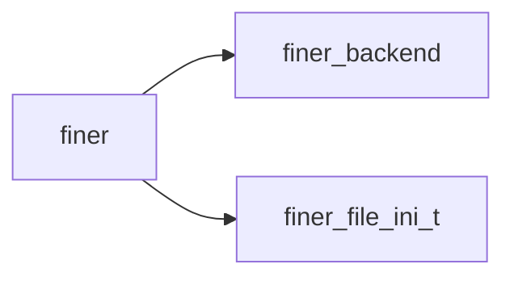

# finer

> FiNeR, Fortran INI ParseR and generator.

**Source**: `src/lib/finer.f90`

**Dependencies**

```mermaid
graph LR
  finer["finer"] --> finer_backend["finer_backend"]
  finer["finer"] --> finer_file_ini_t["finer_file_ini_t"]
```
