# finer_file_ini_t

> INI file class definition.

**Source**: `src/lib/finer_file_ini_t.F90`

**Dependencies**

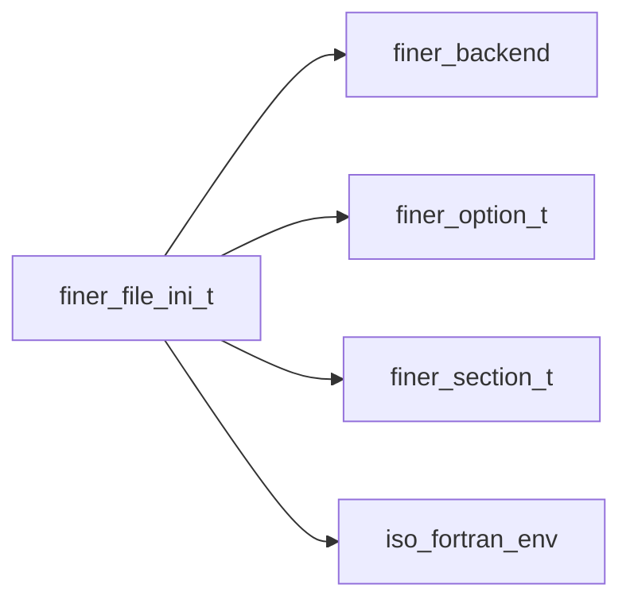

## Contents

- [file_ini](#file-ini)
- [free](#free)
- [get_items](#get-items)
- [get_sections_list](#get-sections-list)
- [initialize](#initialize)
- [load](#load)
- [print_file_ini](#print-file-ini)
- [save_file_ini](#save-file-ini)
- [add_a_option](#add-a-option)
- [add_option](#add-option)
- [add_section](#add-section)
- [free_options_all](#free-options-all)
- [free_option_of_section](#free-option-of-section)
- [free_options_of_section](#free-options-of-section)
- [free_section](#free-section)
- [get_a_option](#get-a-option)
- [get_option](#get-option)
- [parse](#parse)
- [assign_file_ini](#assign-file-ini)
- [file_ini_autotest](#file-ini-autotest)
- [count_values](#count-values)
- [has_option](#has-option)
- [has_section](#has-section)
- [section_file_ini](#section-file-ini)
- [index_option](#index-option)
- [index_section](#index-section)
- [loop_options_section](#loop-options-section)
- [loop_options](#loop-options)

## Derived Types

### file_ini

INI file class.

#### Components

| Name | Type | Attributes | Description |
|------|------|------------|-------------|
| `filename` | character(len=:) | allocatable | File name |
| `Ns` | integer(kind=I4P) |  | Number of sections. |
| `opt_sep` | character(len=1) |  | Separator character of option name/value. |
| `sections` | type([section](/api/src/lib/finer_section_t#section)) | allocatable | Sections. |

#### Type-Bound Procedures

| Name | Attributes | Description |
|------|------------|-------------|
| `add` |  | Add a section. |
| `count_values` | pass(self) | Count option value(s). |
| `del` |  | Remove (freeing) an option of a section. |
| `free` | pass(self) | Free dynamic memory destroyng file data. |
| `free_options` |  | Free all options. |
| `get` |  | Get option value (scalar). |
| `get_items` | pass(self) | Get list of pairs option name/value. |
| `get_sections_list` | pass(self) | Get sections names list. |
| `initialize` | pass(self) | Initialize file. |
| `has_option` | pass(self) | Inquire the presence of an option. |
| `has_section` | pass(self) | Inquire the presence of a section. |
| `index` |  | Return the index of a section. |
| `load` | pass(self) | Load file data. |
| `loop` |  | Loop over options of a section. |
| `print` | pass(self) | Pretty printing data. |
| `save` | pass(self) | Save data. |
| `section` | pass(self) | Get section name once provided an index. |
| `assignment(=)` |  | Procedure for section assignment overloading. |
| `add_a_option` | pass(self) | Add an option to a section (array). |
| `add_option` | pass(self) | Add an option to a section (scalar). |
| `add_section` | pass(self) | Add a section. |
| `free_options_all` | pass(self) | Free all options of all sections. |
| `free_options_of_section` | pass(self) | Free all options of a section. |
| `free_option_of_section` | pass(self) | Free an option of a section. |
| `free_section` | pass(self) | Free a section. |
| `get_a_option` | pass(self) | Get option value (array). |
| `get_option` | pass(self) | Get option value (scalar). |
| `index_option` | pass(self) | Return the index of an option. |
| `index_section` | pass(self) | Return the index of a section. |
| `loop_options` | pass(self) | Loop over all options. |
| `loop_options_section` | pass(self) | Loop over options of a section. |
| `parse` | pass(self) | Parse file data. |
| `assign_file_ini` | pass(lhs) | Assignment overloading. |

## Subroutines

### free

Free dynamic memory.

**Attributes**: elemental

```fortran
subroutine free(self)
```

**Arguments**

| Name | Type | Intent | Attributes | Description |
|------|------|--------|------------|-------------|
| `self` | class([file_ini](/api/src/lib/finer_file_ini_t#file-ini)) | inout |  | File data. |

### get_items

Get list of pairs option name/value.

**Attributes**: pure

```fortran
subroutine get_items(self, items)
```

**Arguments**

| Name | Type | Intent | Attributes | Description |
|------|------|--------|------------|-------------|
| `self` | class([file_ini](/api/src/lib/finer_file_ini_t#file-ini)) | in |  | File data. |
| `items` | character(len=:) | out | allocatable | Items, list of pairs option name/value for all options [1:No,1:2]. |

**Call graph**

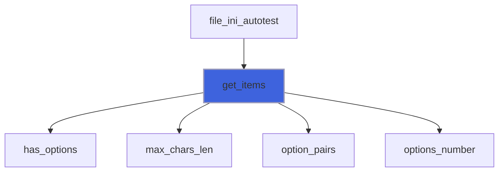

### get_sections_list

Get sections names list.

**Attributes**: pure

```fortran
subroutine get_sections_list(self, list)
```

**Arguments**

| Name | Type | Intent | Attributes | Description |
|------|------|--------|------------|-------------|
| `self` | class([file_ini](/api/src/lib/finer_file_ini_t#file-ini)) | in |  | File data. |
| `list` | character(len=:) | out | allocatable | Sections names list. |

**Call graph**

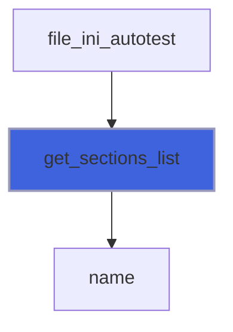

### initialize

Initialize file.

**Attributes**: elemental

```fortran
subroutine initialize(self, filename)
```

**Arguments**

| Name | Type | Intent | Attributes | Description |
|------|------|--------|------------|-------------|
| `self` | class([file_ini](/api/src/lib/finer_file_ini_t#file-ini)) | inout |  | File data. |
| `filename` | character(len=*) | in | optional | File name. |

### load

Get file data from a file or a source string.

### Usage

##### Loading from a file
```bash
type(file_ini):: fini
call fini%load(filename='path_to_my_file.ini')
```

##### Loading from a source string
```bash
type(file_ini):: fini
call fini%load(source='[section-1] option-1=one [section-2] option-2=due')
```

```fortran
subroutine load(self, separator, filename, source, error)
```

**Arguments**

| Name | Type | Intent | Attributes | Description |
|------|------|--------|------------|-------------|
| `self` | class([file_ini](/api/src/lib/finer_file_ini_t#file-ini)) | inout |  | File data. |
| `separator` | character(len=1) | in | optional | Separator of options name/value. |
| `filename` | character(len=*) | in | optional | File name. |
| `source` | character(len=*) | in | optional | File source contents. |
| `error` | integer(kind=I4P) | out | optional | Error code. |

**Call graph**

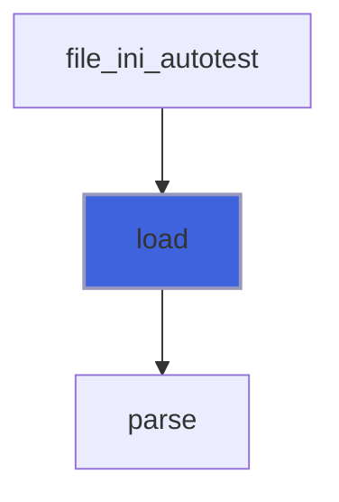

### print_file_ini

Print data with a pretty format.

```fortran
subroutine print_file_ini(self, unit, pref, retain_comments, iostat, iomsg)
```

**Arguments**

| Name | Type | Intent | Attributes | Description |
|------|------|--------|------------|-------------|
| `self` | class([file_ini](/api/src/lib/finer_file_ini_t#file-ini)) | in |  | File data. |
| `unit` | integer(kind=I4P) | in |  | Logic unit. |
| `pref` | character(len=*) | in | optional | Prefixing string. |
| `retain_comments` | logical | in | optional | Flag for retaining eventual comments. |
| `iostat` | integer(kind=I4P) | out | optional | IO error. |
| `iomsg` | character(len=*) | out | optional | IO error message. |

### save_file_ini

Save data.

```fortran
subroutine save_file_ini(self, retain_comments, iostat, iomsg, filename)
```

**Arguments**

| Name | Type | Intent | Attributes | Description |
|------|------|--------|------------|-------------|
| `self` | class([file_ini](/api/src/lib/finer_file_ini_t#file-ini)) | inout |  | File data. |
| `retain_comments` | logical | in | optional | Flag for retaining eventual comments. |
| `iostat` | integer(kind=I4P) | out | optional | IO error. |
| `iomsg` | character(len=*) | out | optional | IO error message. |
| `filename` | character(len=*) | in | optional | File name. |

### add_a_option

Add an option (with array value).

 If the option already exists, its value is updated.

**Attributes**: pure

```fortran
subroutine add_a_option(self, error, section_name, option_name, val)
```

**Arguments**

| Name | Type | Intent | Attributes | Description |
|------|------|--------|------------|-------------|
| `self` | class([file_ini](/api/src/lib/finer_file_ini_t#file-ini)) | inout |  | File data. |
| `error` | integer(kind=I4P) | out | optional | Error code. |
| `section_name` | character(len=*) | in |  | Section name. |
| `option_name` | character(len=*) | in |  | Option name. |
| `val` | class(*) | in |  | Option value. |

**Call graph**


### add_option

Add an option (with scalar value).

 If the option already exists, its value is updated.

**Attributes**: pure

```fortran
subroutine add_option(self, error, section_name, option_name, val)
```

**Arguments**

| Name | Type | Intent | Attributes | Description |
|------|------|--------|------------|-------------|
| `self` | class([file_ini](/api/src/lib/finer_file_ini_t#file-ini)) | inout |  | File data. |
| `error` | integer(kind=I4P) | out | optional | Error code. |
| `section_name` | character(len=*) | in |  | Section name. |
| `option_name` | character(len=*) | in |  | Option name. |
| `val` | class(*) | in |  | Option value. |

**Call graph**


### add_section

Add a section.

 If the section already exists, it is left unchanged.

**Attributes**: pure

```fortran
subroutine add_section(self, error, section_name)
```

**Arguments**

| Name | Type | Intent | Attributes | Description |
|------|------|--------|------------|-------------|
| `self` | class([file_ini](/api/src/lib/finer_file_ini_t#file-ini)) | inout |  | File data. |
| `error` | integer(kind=I4P) | out | optional | Error code. |
| `section_name` | character(len=*) | in |  | Section name. |

### free_options_all

Free all options of all sections.

**Attributes**: elemental

```fortran
subroutine free_options_all(self)
```

**Arguments**

| Name | Type | Intent | Attributes | Description |
|------|------|--------|------------|-------------|
| `self` | class([file_ini](/api/src/lib/finer_file_ini_t#file-ini)) | inout |  | File data. |

**Call graph**


### free_option_of_section

Free all options of a section.

**Attributes**: elemental

```fortran
subroutine free_option_of_section(self, section_name, option_name)
```

**Arguments**

| Name | Type | Intent | Attributes | Description |
|------|------|--------|------------|-------------|
| `self` | class([file_ini](/api/src/lib/finer_file_ini_t#file-ini)) | inout |  | File data. |
| `section_name` | character(len=*) | in |  | Section name. |
| `option_name` | character(len=*) | in |  | Option  name. |

**Call graph**

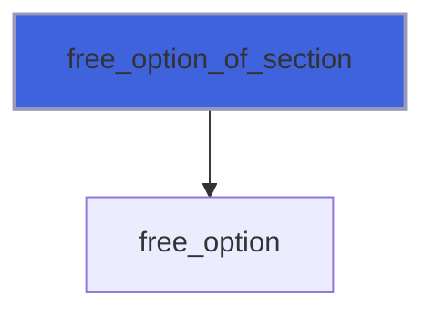

### free_options_of_section

Free all options of a section.

**Attributes**: elemental

```fortran
subroutine free_options_of_section(self, section_name)
```

**Arguments**

| Name | Type | Intent | Attributes | Description |
|------|------|--------|------------|-------------|
| `self` | class([file_ini](/api/src/lib/finer_file_ini_t#file-ini)) | inout |  | File data. |
| `section_name` | character(len=*) | in |  | Section name. |

**Call graph**

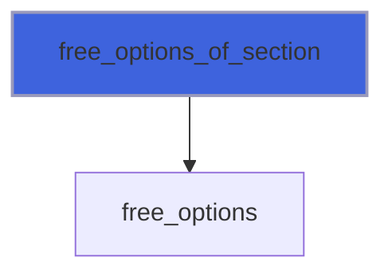

### free_section

Free all options of a section.

**Attributes**: elemental

```fortran
subroutine free_section(self, section_name)
```

**Arguments**

| Name | Type | Intent | Attributes | Description |
|------|------|--------|------------|-------------|
| `self` | class([file_ini](/api/src/lib/finer_file_ini_t#file-ini)) | inout |  | File data. |
| `section_name` | character(len=*) | in |  | Section name. |

### get_a_option

Get option value (array)

```fortran
subroutine get_a_option(self, section_name, option_name, val, delimiter, error)
```

**Arguments**

| Name | Type | Intent | Attributes | Description |
|------|------|--------|------------|-------------|
| `self` | class([file_ini](/api/src/lib/finer_file_ini_t#file-ini)) | in |  | File data. |
| `section_name` | character(len=*) | in |  | Section name. |
| `option_name` | character(len=*) | in |  | Option name. |
| `val` | class(*) | inout |  | Value. |
| `delimiter` | character(len=*) | in | optional | Delimiter used for separating values. |
| `error` | integer(kind=I4P) | out | optional | Error code. |

**Call graph**


### get_option

Get option value (scalar).

```fortran
subroutine get_option(self, section_name, option_name, val, error)
```

**Arguments**

| Name | Type | Intent | Attributes | Description |
|------|------|--------|------------|-------------|
| `self` | class([file_ini](/api/src/lib/finer_file_ini_t#file-ini)) | in |  | File data. |
| `section_name` | character(len=*) | in |  | Section name. |
| `option_name` | character(len=*) | in |  | Option name. |
| `val` | class(*) | inout |  | Value. |
| `error` | integer(kind=I4P) | out | optional | Error code. |

**Call graph**

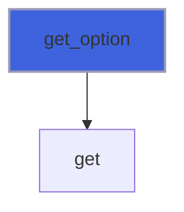

### parse

Parse file either from the self source data or from a source string.

```fortran
subroutine parse(self, source, error)
```

**Arguments**

| Name | Type | Intent | Attributes | Description |
|------|------|--------|------------|-------------|
| `self` | class([file_ini](/api/src/lib/finer_file_ini_t#file-ini)) | inout |  | File data. |
| `source` | type(string) | in |  | String source. |
| `error` | integer(kind=I4P) | out | optional | Error code. |

**Call graph**

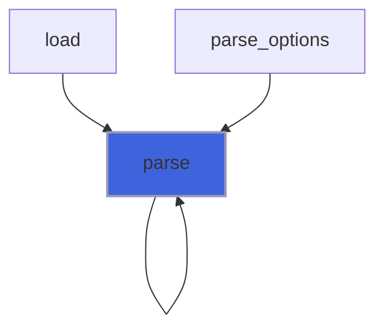

### assign_file_ini

Assignment between two INI files.

**Attributes**: elemental

```fortran
subroutine assign_file_ini(lhs, rhs)
```

**Arguments**

| Name | Type | Intent | Attributes | Description |
|------|------|--------|------------|-------------|
| `lhs` | class([file_ini](/api/src/lib/finer_file_ini_t#file-ini)) | inout |  | Left hand side. |
| `rhs` | type([file_ini](/api/src/lib/finer_file_ini_t#file-ini)) | in |  | Rigth hand side. |

### file_ini_autotest

Autotest the library functionalities.

```fortran
subroutine file_ini_autotest()
```

**Call graph**

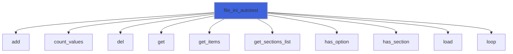

## Functions

### count_values

Get the number of values of option into section data.

**Attributes**: elemental

**Returns**: `integer(kind=I4P)`

```fortran
function count_values(self, delimiter, section_name, option_name) result(Nv)
```

**Arguments**

| Name | Type | Intent | Attributes | Description |
|------|------|--------|------------|-------------|
| `self` | class([file_ini](/api/src/lib/finer_file_ini_t#file-ini)) | in |  | File data. |
| `delimiter` | character(len=*) | in | optional | Delimiter used for separating values. |
| `section_name` | character(len=*) | in |  | Section name. |
| `option_name` | character(len=*) | in |  | Option name. |

**Call graph**

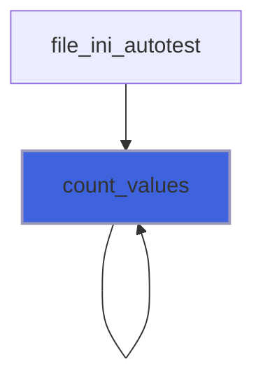

### has_option

Inquire the presence of (at least one) option with the name passed.

 Optional, the first matching section name is returned.

 @note All sections are searched and the first occurence is returned.

**Returns**: `logical`

```fortran
function has_option(self, option_name, section_name) result(pres)
```

**Arguments**

| Name | Type | Intent | Attributes | Description |
|------|------|--------|------------|-------------|
| `self` | class([file_ini](/api/src/lib/finer_file_ini_t#file-ini)) | in |  | File data. |
| `option_name` | character(len=*) | in |  | Option name. |
| `section_name` | character(len=*) | inout | optional | Section name. |

**Call graph**

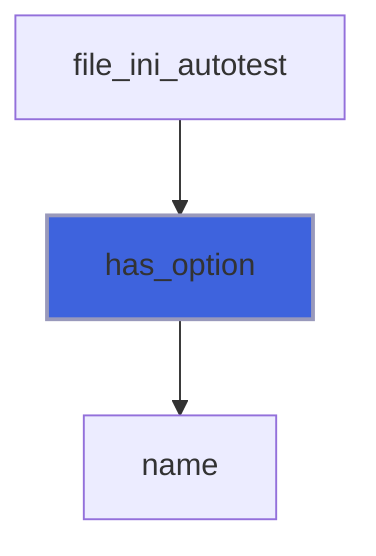

### has_section

Inquire the presence of (at least one) section with the name passed.

**Attributes**: elemental

**Returns**: `logical`

```fortran
function has_section(self, section_name) result(pres)
```

**Arguments**

| Name | Type | Intent | Attributes | Description |
|------|------|--------|------------|-------------|
| `self` | class([file_ini](/api/src/lib/finer_file_ini_t#file-ini)) | in |  | File data. |
| `section_name` | character(len=*) | in |  | Section name. |

**Call graph**

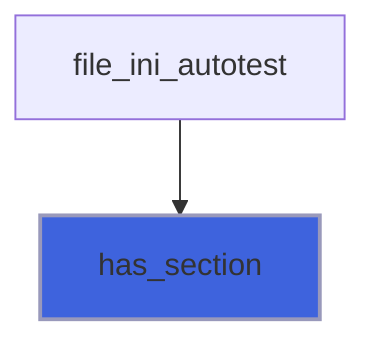

### section_file_ini

Get section name once an index (valid) is provided.

**Attributes**: pure

**Returns**: `character(len=:)`

```fortran
function section_file_ini(self, section_index) result(sname)
```

**Arguments**

| Name | Type | Intent | Attributes | Description |
|------|------|--------|------------|-------------|
| `self` | class([file_ini](/api/src/lib/finer_file_ini_t#file-ini)) | in |  | File data. |
| `section_index` | integer(kind=I4P) | in |  | Section index. |

**Call graph**

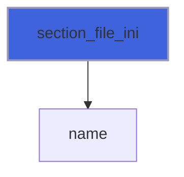

### index_option

Return the index of the option (inside a  section) matching the name(s) passed.

 @note The matching index returned is the first found if *back* is not passed or if *back=.false.*. On the contrary the last
 found is returned if *back=.true.*.

**Attributes**: elemental

**Returns**: `integer(kind=I4P)`

```fortran
function index_option(self, back, section_name, option_name) result(ind)
```

**Arguments**

| Name | Type | Intent | Attributes | Description |
|------|------|--------|------------|-------------|
| `self` | class([file_ini](/api/src/lib/finer_file_ini_t#file-ini)) | in |  | File data. |
| `back` | logical | in | optional | If back appears with the value true, the last matching index is returned. |
| `section_name` | character(len=*) | in |  | Section name. |
| `option_name` | character(len=*) | in |  | Option  name. |

### index_section

Return the index of the section matching the name passed.

 @note The matching index returned is the first found if *back* is not passed or if *back=.false.*. On the contrary the last
 found is returned if *back=.true.*.

**Attributes**: elemental

**Returns**: `integer(kind=I4P)`

```fortran
function index_section(self, back, section_name) result(ind)
```

**Arguments**

| Name | Type | Intent | Attributes | Description |
|------|------|--------|------------|-------------|
| `self` | class([file_ini](/api/src/lib/finer_file_ini_t#file-ini)) | in |  | File data. |
| `back` | logical | in | optional | If back appears with the value true, the last matching index is returned. |
| `section_name` | character(len=*) | in |  | Section name. |

### loop_options_section

Loop returning option name/value defined into section.

**Returns**: `logical`

```fortran
function loop_options_section(self, section_name, option_pairs) result(again)
```

**Arguments**

| Name | Type | Intent | Attributes | Description |
|------|------|--------|------------|-------------|
| `self` | class([file_ini](/api/src/lib/finer_file_ini_t#file-ini)) | in |  | File data. |
| `section_name` | character(len=*) | in |  | Section name. |
| `option_pairs` | character(len=:) | out | allocatable | Pairs option name/value [1:2]. |

**Call graph**

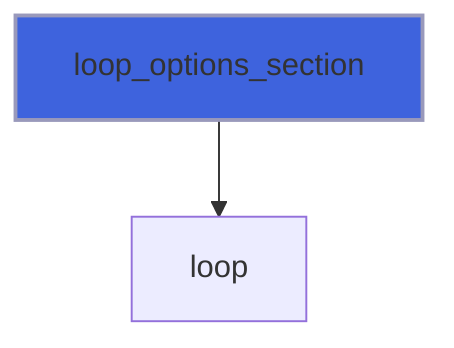

### loop_options

Loop returning option name/value defined into all sections.

**Attributes**: recursive

**Returns**: `logical`

```fortran
function loop_options(self, option_pairs) result(again)
```

**Arguments**

| Name | Type | Intent | Attributes | Description |
|------|------|--------|------------|-------------|
| `self` | class([file_ini](/api/src/lib/finer_file_ini_t#file-ini)) | in |  | File data. |
| `option_pairs` | character(len=:) | out | allocatable | Pairs option name/value [1:2]. |

**Call graph**

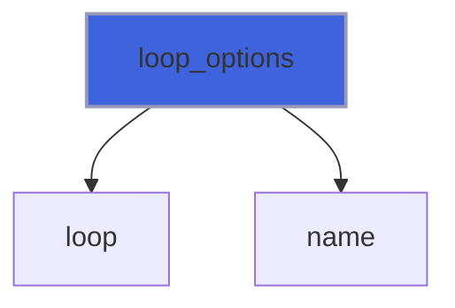
