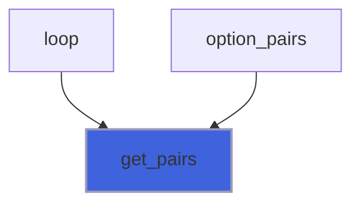
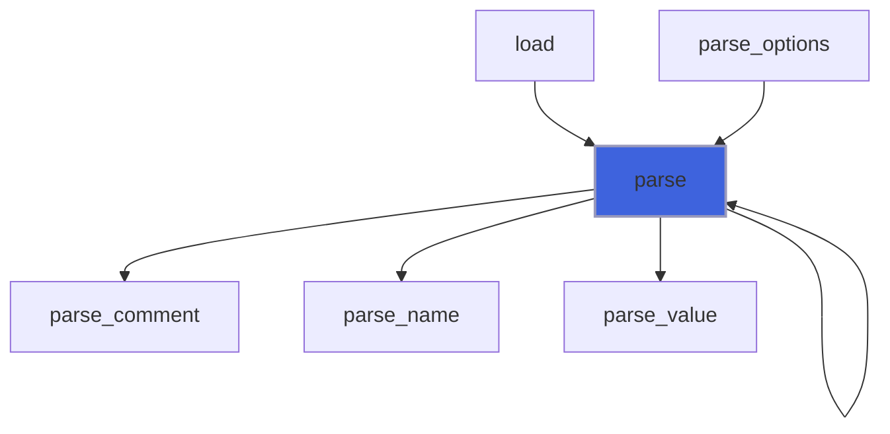
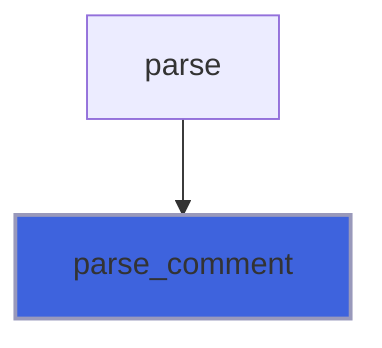
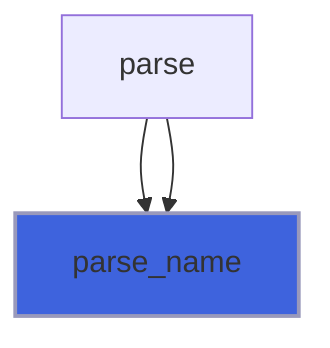
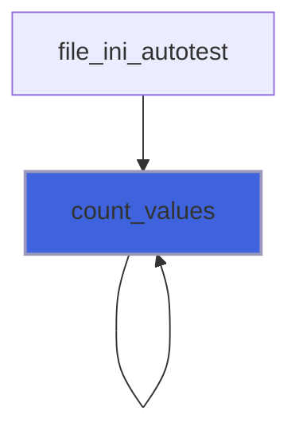
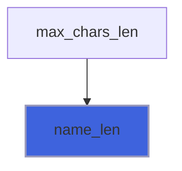
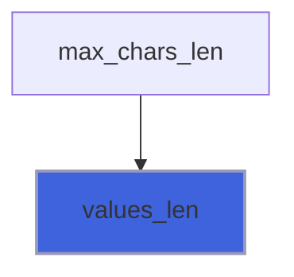

# finer_option_t

> Option class definition.

**Source**: `src/lib/finer_option_t.F90`

**Dependencies**


## Contents

- [option](#option)
- [option](#option)
- [free](#free)
- [get_pairs](#get-pairs)
- [parse](#parse)
- [get_option](#get-option)
- [get_a_option](#get-a-option)
- [parse_comment](#parse-comment)
- [parse_name](#parse-name)
- [parse_value](#parse-value)
- [print_option](#print-option)
- [set_option](#set-option)
- [set_a_option](#set-a-option)
- [save_option](#save-option)
- [assign_option](#assign-option)
- [count_values](#count-values)
- [name_len](#name-len)
- [values_len](#values-len)
- [option_eq_string](#option-eq-string)
- [option_eq_character](#option-eq-character)
- [new_option](#new-option)

## Derived Types

### option

Option data of sections.

#### Components

| Name | Type | Attributes | Description |
|------|------|------------|-------------|
| `oname` | type(string) |  | Option name. |
| `ovals` | type(string) |  | Option values. |
| `ocomm` | type(string) |  | Eventual option inline comment. |

#### Type-Bound Procedures

| Name | Attributes | Description |
|------|------------|-------------|
| `count_values` | pass(self) | Counting option value(s). |
| `free` | pass(self) | Free dynamic memory. |
| `get` |  | Get option value (scalar). |
| `get_pairs` | pass(self) | Return option name/values pairs. |
| `name_len` | pass(self) | Return option name length. |
| `parse` | pass(self) | Parse option data. |
| `print` | pass(self) | Pretty print data. |
| `save` | pass(self) | Save data. |
| `set` |  | Set option value (scalar). |
| `values_len` | pass(self) | Return option values length. |
| `assignment(=)` |  | Assignment overloading. |
| `operator(==)` |  | Equal operator overloading. |
| `get_option` | pass(self) | Get option value (scalar). |
| `get_a_option` | pass(self) | Get option value (array). |
| `parse_comment` | pass(self) | Parse option inline comment. |
| `parse_name` | pass(self) | Parse option name. |
| `parse_value` | pass(self) | Parse option values. |
| `set_option` | pass(self) | Set option value (scalar). |
| `set_a_option` | pass(self) | Set option value (array). |
| `assign_option` | pass(lhs) | Assignment overloading. |
| `option_eq_string` | pass(lhs) | Equal to string logical operator. |
| `option_eq_character` | pass(lhs) | Equal to character logical operator. |

## Interfaces

### option

Overload `option` name with a function returning a new (initiliazed) option instance.

**Module procedures**: [`new_option`](/api/src/lib/finer_option_t#new-option)

## Subroutines

### free

Free dynamic memory.

**Attributes**: elemental

```fortran
subroutine free(self)
```

**Arguments**

| Name | Type | Intent | Attributes | Description |
|------|------|--------|------------|-------------|
| `self` | class([option](/api/src/lib/finer_option_t#option)) | inout |  | Option data. |

### get_pairs

Return option name/values pairs.

**Attributes**: pure

```fortran
subroutine get_pairs(self, pairs)
```

**Arguments**

| Name | Type | Intent | Attributes | Description |
|------|------|--------|------------|-------------|
| `self` | class([option](/api/src/lib/finer_option_t#option)) | in |  | Option data. |
| `pairs` | character(len=:) | out | allocatable | Option name/values pairs. |

**Call graph**



### parse

Parse option data from a source string.

**Attributes**: elemental

```fortran
subroutine parse(self, sep, source, error)
```

**Arguments**

| Name | Type | Intent | Attributes | Description |
|------|------|--------|------------|-------------|
| `self` | class([option](/api/src/lib/finer_option_t#option)) | inout |  | Option data. |
| `sep` | character(len=*) | in |  | Separator of option name/value. |
| `source` | type(string) | inout |  | String containing option data. |
| `error` | integer(kind=I4P) | out |  | Error code. |

**Call graph**



### get_option

for getting option data value (scalar).

```fortran
subroutine get_option(self, val, error)
```

**Arguments**

| Name | Type | Intent | Attributes | Description |
|------|------|--------|------------|-------------|
| `self` | class([option](/api/src/lib/finer_option_t#option)) | in |  | Option data. |
| `val` | class(*) | inout |  | Value. |
| `error` | integer(kind=I4P) | out | optional | Error code. |

### get_a_option

Get option data values (array).

```fortran
subroutine get_a_option(self, val, delimiter, error)
```

**Arguments**

| Name | Type | Intent | Attributes | Description |
|------|------|--------|------------|-------------|
| `self` | class([option](/api/src/lib/finer_option_t#option)) | in |  | Option data. |
| `val` | class(*) | inout |  | Value. |
| `delimiter` | character(len=*) | in | optional | Delimiter used for separating values. |
| `error` | integer(kind=I4P) | out | optional | Error code. |

### parse_comment

Parse option inline comment trimming it out from pure value string.

**Attributes**: elemental

```fortran
subroutine parse_comment(self)
```

**Arguments**

| Name | Type | Intent | Attributes | Description |
|------|------|--------|------------|-------------|
| `self` | class([option](/api/src/lib/finer_option_t#option)) | inout |  | Option data. |

**Call graph**



### parse_name

Parse option name from a source string.

**Attributes**: elemental

```fortran
subroutine parse_name(self, sep, source, error)
```

**Arguments**

| Name | Type | Intent | Attributes | Description |
|------|------|--------|------------|-------------|
| `self` | class([option](/api/src/lib/finer_option_t#option)) | inout |  | Option data. |
| `sep` | character(len=*) | in |  | Separator of option name/value. |
| `source` | type(string) | in |  | String containing option data. |
| `error` | integer(kind=I4P) | out |  | Error code. |

**Call graph**



### parse_value

Parse option value from a source string.

**Attributes**: elemental

```fortran
subroutine parse_value(self, sep, source, error)
```

**Arguments**

| Name | Type | Intent | Attributes | Description |
|------|------|--------|------------|-------------|
| `self` | class([option](/api/src/lib/finer_option_t#option)) | inout |  | Option data. |
| `sep` | character(len=*) | in |  | Separator of option name/value. |
| `source` | type(string) | in |  | String containing option data. |
| `error` | integer(kind=I4P) | out |  | Error code. |

**Call graph**


### print_option

Print data with a pretty format.

```fortran
subroutine print_option(self, unit, retain_comments, pref, iostat, iomsg)
```

**Arguments**

| Name | Type | Intent | Attributes | Description |
|------|------|--------|------------|-------------|
| `self` | class([option](/api/src/lib/finer_option_t#option)) | in |  | Option data. |
| `unit` | integer(kind=I4P) | in |  | Logic unit. |
| `retain_comments` | logical | in |  | Flag for retaining eventual comments. |
| `pref` | character(len=*) | in | optional | Prefixing string. |
| `iostat` | integer(kind=I4P) | out | optional | IO error. |
| `iomsg` | character(len=*) | out | optional | IO error message. |

### set_option

Set option data value (scalar).

**Attributes**: pure

```fortran
subroutine set_option(self, val)
```

**Arguments**

| Name | Type | Intent | Attributes | Description |
|------|------|--------|------------|-------------|
| `self` | class([option](/api/src/lib/finer_option_t#option)) | inout |  | Option data. |
| `val` | class(*) | in |  | Value. |

### set_a_option

Set option data value (array).

**Attributes**: pure

```fortran
subroutine set_a_option(self, val, delimiter)
```

**Arguments**

| Name | Type | Intent | Attributes | Description |
|------|------|--------|------------|-------------|
| `self` | class([option](/api/src/lib/finer_option_t#option)) | inout |  | Option data. |
| `val` | class(*) | in |  | Value. |
| `delimiter` | character(len=*) | in | optional | Delimiter used for separating values. |

### save_option

Save data.

```fortran
subroutine save_option(self, unit, retain_comments, iostat, iomsg)
```

**Arguments**

| Name | Type | Intent | Attributes | Description |
|------|------|--------|------------|-------------|
| `self` | class([option](/api/src/lib/finer_option_t#option)) | in |  | Option data. |
| `unit` | integer(kind=I4P) | in |  | Logic unit. |
| `retain_comments` | logical | in |  | Flag for retaining eventual comments. |
| `iostat` | integer(kind=I4P) | out | optional | IO error. |
| `iomsg` | character(len=*) | out | optional | IO error message. |

### assign_option

Assignment between two options.

**Attributes**: elemental

```fortran
subroutine assign_option(lhs, rhs)
```

**Arguments**

| Name | Type | Intent | Attributes | Description |
|------|------|--------|------------|-------------|
| `lhs` | class([option](/api/src/lib/finer_option_t#option)) | inout |  | Left hand side. |
| `rhs` | type([option](/api/src/lib/finer_option_t#option)) | in |  | Rigth hand side. |

## Functions

### count_values

Get the number of values of option data.

**Attributes**: elemental

**Returns**: `integer(kind=I4P)`

```fortran
function count_values(self, delimiter) result(Nv)
```

**Arguments**

| Name | Type | Intent | Attributes | Description |
|------|------|--------|------------|-------------|
| `self` | class([option](/api/src/lib/finer_option_t#option)) | in |  | Option data. |
| `delimiter` | character(len=*) | in | optional | Delimiter used for separating values. |

**Call graph**



### name_len

Return option name length.

**Attributes**: elemental

**Returns**: `integer`

```fortran
function name_len(self) result(length)
```

**Arguments**

| Name | Type | Intent | Attributes | Description |
|------|------|--------|------------|-------------|
| `self` | class([option](/api/src/lib/finer_option_t#option)) | in |  | Option data. |

**Call graph**



### values_len

Return option values length.

**Attributes**: elemental

**Returns**: `integer`

```fortran
function values_len(self) result(length)
```

**Arguments**

| Name | Type | Intent | Attributes | Description |
|------|------|--------|------------|-------------|
| `self` | class([option](/api/src/lib/finer_option_t#option)) | in |  | Option data. |

**Call graph**



### option_eq_string

Equal to string logical operator.

**Attributes**: elemental

**Returns**: `logical`

```fortran
function option_eq_string(lhs, rhs) result(is_it)
```

**Arguments**

| Name | Type | Intent | Attributes | Description |
|------|------|--------|------------|-------------|
| `lhs` | class([option](/api/src/lib/finer_option_t#option)) | in |  | Left hand side. |
| `rhs` | type(string) | in |  | Right hand side. |

### option_eq_character

Equal to character logical operator.

**Attributes**: elemental

**Returns**: `logical`

```fortran
function option_eq_character(lhs, rhs) result(is_it)
```

**Arguments**

| Name | Type | Intent | Attributes | Description |
|------|------|--------|------------|-------------|
| `lhs` | class([option](/api/src/lib/finer_option_t#option)) | in |  | Left hand side. |
| `rhs` | character(kind=CK, len=*) | in |  | Right hand side. |

### new_option

Return a new (initiliazed) option instance.

**Attributes**: elemental

**Returns**: type([option](/api/src/lib/finer_option_t#option))

```fortran
function new_option(option_name, option_values, option_comment)
```

**Arguments**

| Name | Type | Intent | Attributes | Description |
|------|------|--------|------------|-------------|
| `option_name` | character(len=*) | in | optional | Option name. |
| `option_values` | character(len=*) | in | optional | Option values. |
| `option_comment` | character(len=*) | in | optional | Option comment. |
