# finer_section_t

> Section class definition.

**Source**: `src/lib/finer_section_t.f90`

**Dependencies**

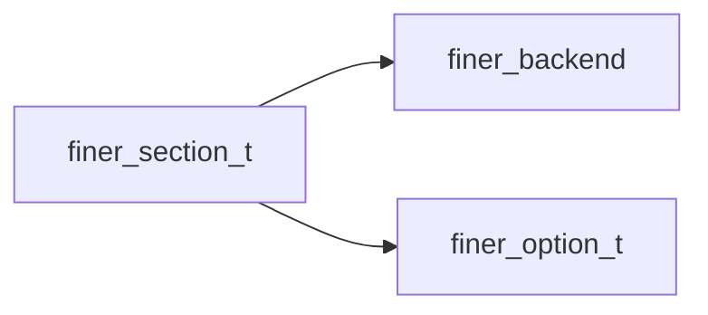

## Contents

- [section](#section)
- [section](#section)
- [free](#free)
- [free_options](#free-options)
- [free_option](#free-option)
- [option_pairs](#option-pairs)
- [parse](#parse)
- [print_section](#print-section)
- [save_section](#save-section)
- [add_option](#add-option)
- [add_a_option](#add-a-option)
- [get_option](#get-option)
- [get_a_option](#get-a-option)
- [parse_name](#parse-name)
- [parse_options](#parse-options)
- [sanitize_source](#sanitize-source)
- [set_option](#set-option)
- [set_a_option](#set-a-option)
- [assign_section](#assign-section)
- [count_values](#count-values)
- [has_options](#has-options)
- [index_option](#index-option)
- [loop](#loop)
- [max_chars_len](#max-chars-len)
- [name](#name)
- [options_number](#options-number)
- [section_eq_string](#section-eq-string)
- [section_eq_character](#section-eq-character)
- [new_section](#new-section)

## Derived Types

### section

Section data of file INI.

#### Components

| Name | Type | Attributes | Description |
|------|------|------------|-------------|
| `sname` | character(len=:) | allocatable | Section name. |
| `options` | type([option](/api/src/lib/finer_option_t#option)) | allocatable | Section options. |

#### Type-Bound Procedures

| Name | Attributes | Description |
|------|------------|-------------|
| `add` |  | Add an option (scalar). |
| `count_values` | pass(self) | Count option value(s). |
| `free` | pass(self) | Free dynamic memory. |
| `free_options` | pass(self) | Free all options. |
| `free_option` | pass(self) | Free a option. |
| `get` |  | Get option value (scalar). |
| `has_options` | pass(self) | Inquire if section has options. |
| `index` | pass(self) | Return the index of an option. |
| `loop` | pass(self) | Loop over options. |
| `max_chars_len` | pass(self) | Return max len of option-name/values on all options. |
| `name` | pass(self) | Return section name. |
| `options_number` | pass(self) | Return the options number. |
| `option_pairs` | pass(self) | Return an option pairs. |
| `parse` | pass(self) | Parse section data. |
| `print` | pass(self) | Pretty print data. |
| `set` |  | Set option value (scalar). |
| `save` | pass(self) | Save data. |
| `assignment(=)` |  | Assignment overloading. |
| `operator(==)` |  | Equal operator overloading. |
| `add_option` | pass(self) | Add an option (scalar). |
| `add_a_option` | pass(self) | Add an option (array). |
| `get_option` | pass(self) | Get option value (scalar). |
| `get_a_option` | pass(self) | Get option value (array). |
| `parse_name` | pass(self) | Get section name. |
| `parse_options` | pass(self) | Get section options. |
| `sanitize_source` | nopass | Sanitize source. |
| `set_option` | pass(self) | Set option value (scalar). |
| `set_a_option` | pass(self) | Set option value (array). |
| `assign_section` | pass(lhs) | Assignment overloading. |
| `section_eq_string` | pass(lhs) | Equal to string logical operator. |
| `section_eq_character` | pass(lhs) | Equal to character logical operator. |

## Interfaces

### section

Overload `section` name with a function returning a new (itiliazed) section instance.

**Module procedures**: [`new_section`](/api/src/lib/finer_section_t#new-section)

## Subroutines

### free

Free dynamic memory.

**Attributes**: elemental

```fortran
subroutine free(self)
```

**Arguments**

| Name | Type | Intent | Attributes | Description |
|------|------|--------|------------|-------------|
| `self` | class([section](/api/src/lib/finer_section_t#section)) | inout |  | Section data. |

**Call graph**

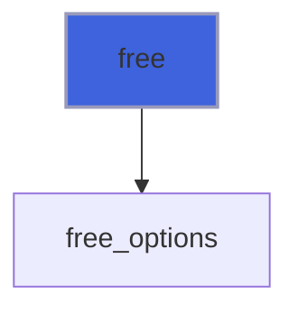

### free_options

Free all options.

**Attributes**: elemental

```fortran
subroutine free_options(self)
```

**Arguments**

| Name | Type | Intent | Attributes | Description |
|------|------|--------|------------|-------------|
| `self` | class([section](/api/src/lib/finer_section_t#section)) | inout |  | Section data. |

**Call graph**

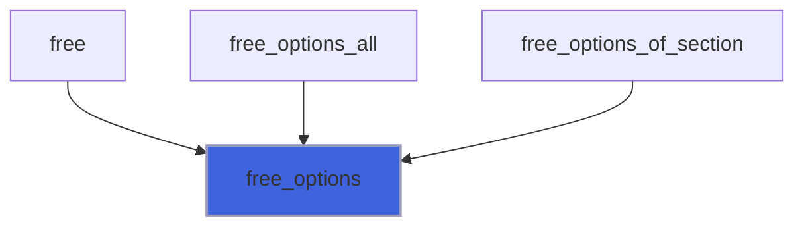

### free_option

Free an option.

**Attributes**: elemental

```fortran
subroutine free_option(self, option_name)
```

**Arguments**

| Name | Type | Intent | Attributes | Description |
|------|------|--------|------------|-------------|
| `self` | class([section](/api/src/lib/finer_section_t#section)) | inout |  | Section data. |
| `option_name` | character(len=*) | in |  | Option name. |

**Call graph**

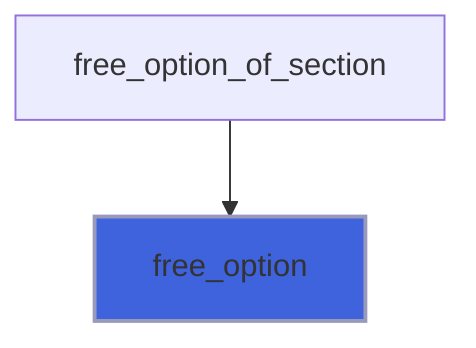

### option_pairs

Return an option pairs.

**Attributes**: pure

```fortran
subroutine option_pairs(self, option_index, pairs)
```

**Arguments**

| Name | Type | Intent | Attributes | Description |
|------|------|--------|------------|-------------|
| `self` | class([section](/api/src/lib/finer_section_t#section)) | in |  | Option data. |
| `option_index` | integer | in |  | Option index. |
| `pairs` | character(len=:) | out | allocatable | Option name/values pairs. |

**Call graph**

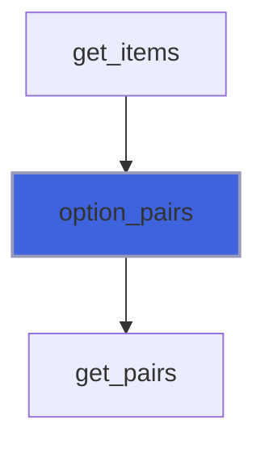

### parse

Gett section data from a source string.

**Attributes**: elemental

```fortran
subroutine parse(self, sep, source, error, token_failed)
```

**Arguments**

| Name | Type | Intent | Attributes | Description |
|------|------|--------|------------|-------------|
| `self` | class([section](/api/src/lib/finer_section_t#section)) | inout |  | Section data. |
| `sep` | character(len=*) | in |  | Separator of option name/value. |
| `source` | type(string) | inout |  | String containing section data. |
| `error` | integer(kind=I4P) | out |  | Error code. |
| `token_failed` | type(string) | out | optional | Eventual token failed to parse. |

**Call graph**

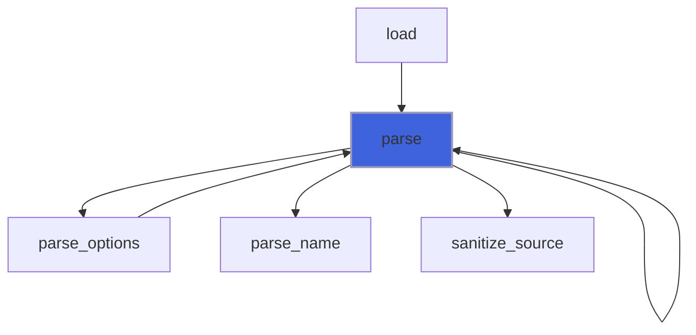

### print_section

Print data with a pretty format.

```fortran
subroutine print_section(self, unit, retain_comments, pref, iostat, iomsg)
```

**Arguments**

| Name | Type | Intent | Attributes | Description |
|------|------|--------|------------|-------------|
| `self` | class([section](/api/src/lib/finer_section_t#section)) | in |  | Section data. |
| `unit` | integer(kind=I4P) | in |  | Logic unit. |
| `retain_comments` | logical | in |  | Flag for retaining eventual comments. |
| `pref` | character(len=*) | in | optional | Prefixing string. |
| `iostat` | integer(kind=I4P) | out | optional | IO error. |
| `iomsg` | character(len=*) | out | optional | IO error message. |

### save_section

Save data.

```fortran
subroutine save_section(self, unit, retain_comments, iostat, iomsg)
```

**Arguments**

| Name | Type | Intent | Attributes | Description |
|------|------|--------|------------|-------------|
| `self` | class([section](/api/src/lib/finer_section_t#section)) | in |  | Section data. |
| `unit` | integer(kind=I4P) | in |  | Logic unit. |
| `retain_comments` | logical | in |  | Flag for retaining eventual comments. |
| `iostat` | integer(kind=I4P) | out | optional | IO error. |
| `iomsg` | character(len=*) | out | optional | IO error message. |

### add_option

Add an option (with scalar value).

 If the option already exists, its value is updated.

**Attributes**: pure

```fortran
subroutine add_option(self, option_name, val, error)
```

**Arguments**

| Name | Type | Intent | Attributes | Description |
|------|------|--------|------------|-------------|
| `self` | class([section](/api/src/lib/finer_section_t#section)) | inout |  | Section data. |
| `option_name` | character(len=*) | in |  | Option name. |
| `val` | class(*) | in |  | Option value. |
| `error` | integer(kind=I4P) | out | optional | Error code. |

**Call graph**

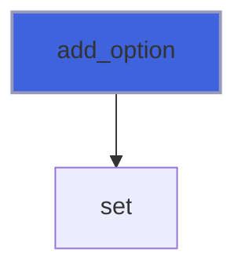

### add_a_option

Add an option (with array value).

 If the option already exists, its value is updated.

**Attributes**: pure

```fortran
subroutine add_a_option(self, option_name, val, delimiter, error)
```

**Arguments**

| Name | Type | Intent | Attributes | Description |
|------|------|--------|------------|-------------|
| `self` | class([section](/api/src/lib/finer_section_t#section)) | inout |  | Section data. |
| `option_name` | character(len=*) | in |  | Option name. |
| `val` | class(*) | in |  | Option value. |
| `delimiter` | character(len=*) | in | optional | Delimiter used for separating values. |
| `error` | integer(kind=I4P) | out | optional | Error code. |

**Call graph**

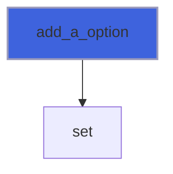

### get_option

Get option value (scalar).

```fortran
subroutine get_option(self, option_name, val, error)
```

**Arguments**

| Name | Type | Intent | Attributes | Description |
|------|------|--------|------------|-------------|
| `self` | class([section](/api/src/lib/finer_section_t#section)) | in |  | Section data. |
| `option_name` | character(len=*) | in |  | Option name. |
| `val` | class(*) | inout |  | Value. |
| `error` | integer(kind=I4P) | out | optional | Error code. |

**Call graph**

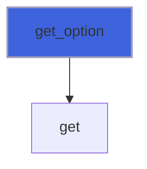

### get_a_option

Procedure for getting option value (array).

```fortran
subroutine get_a_option(self, option_name, val, delimiter, error)
```

**Arguments**

| Name | Type | Intent | Attributes | Description |
|------|------|--------|------------|-------------|
| `self` | class([section](/api/src/lib/finer_section_t#section)) | in |  | Section data. |
| `option_name` | character(len=*) | in |  | Option name. |
| `val` | class(*) | inout |  | Value. |
| `delimiter` | character(len=*) | in | optional | Delimiter used for separating values. |
| `error` | integer(kind=I4P) | out | optional | Error code. |

**Call graph**

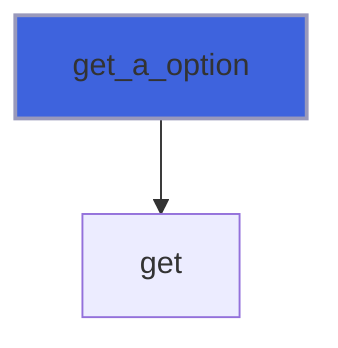

### parse_name

Get section name from a source string.

**Attributes**: elemental

```fortran
subroutine parse_name(self, source, error)
```

**Arguments**

| Name | Type | Intent | Attributes | Description |
|------|------|--------|------------|-------------|
| `self` | class([section](/api/src/lib/finer_section_t#section)) | inout |  | Section data. |
| `source` | type(string) | in |  | String containing section data. |
| `error` | integer(kind=I4P) | out |  | Error code. |

**Call graph**

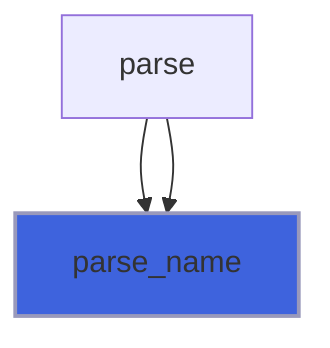

### parse_options

Get section options from a source string.

**Attributes**: elemental

```fortran
subroutine parse_options(self, sep, source, error, token_failed)
```

**Arguments**

| Name | Type | Intent | Attributes | Description |
|------|------|--------|------------|-------------|
| `self` | class([section](/api/src/lib/finer_section_t#section)) | inout |  | Section data. |
| `sep` | character(len=*) | in |  | Separator of option name/value. |
| `source` | type(string) | inout |  | String containing section data. |
| `error` | integer(kind=I4P) | out |  | Error code. |
| `token_failed` | type(string) | out | optional | Eventual token failed to parse. |

**Call graph**

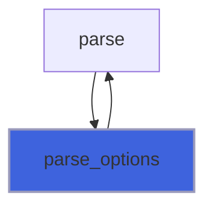

### sanitize_source

Sanitize source.

+ Join splitted options;

**Attributes**: elemental

```fortran
subroutine sanitize_source(sep, source, error)
```

**Arguments**

| Name | Type | Intent | Attributes | Description |
|------|------|--------|------------|-------------|
| `sep` | character(len=*) | in |  | Separator of option name/value. |
| `source` | type(string) | inout |  | String containing option data. |
| `error` | integer(kind=I4P) | out |  | Error code. |

**Call graph**

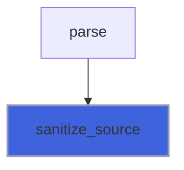

### set_option

Set option value (scalar).

**Attributes**: pure

```fortran
subroutine set_option(self, option_name, val, error)
```

**Arguments**

| Name | Type | Intent | Attributes | Description |
|------|------|--------|------------|-------------|
| `self` | class([section](/api/src/lib/finer_section_t#section)) | inout |  | Section data. |
| `option_name` | character(len=*) | in |  | Option name. |
| `val` | class(*) | in |  | Value. |
| `error` | integer(kind=I4P) | out | optional | Error code. |

**Call graph**


### set_a_option

Set option value (array).

**Attributes**: pure

```fortran
subroutine set_a_option(self, option_name, val, delimiter, error)
```

**Arguments**

| Name | Type | Intent | Attributes | Description |
|------|------|--------|------------|-------------|
| `self` | class([section](/api/src/lib/finer_section_t#section)) | inout |  | Section data. |
| `option_name` | character(len=*) | in |  | Option name. |
| `val` | class(*) | in |  | Value. |
| `delimiter` | character(len=*) | in | optional | Delimiter used for separating values. |
| `error` | integer(kind=I4P) | out | optional | Error code. |

**Call graph**


### assign_section

Assignment between two sections.

**Attributes**: elemental

```fortran
subroutine assign_section(lhs, rhs)
```

**Arguments**

| Name | Type | Intent | Attributes | Description |
|------|------|--------|------------|-------------|
| `lhs` | class([section](/api/src/lib/finer_section_t#section)) | inout |  | Left hand side. |
| `rhs` | type([section](/api/src/lib/finer_section_t#section)) | in |  | Rigth hand side. |

## Functions

### count_values

Get the number of values of option into section data.

**Attributes**: elemental

**Returns**: `integer(kind=I4P)`

```fortran
function count_values(self, option_name, delimiter) result(Nv)
```

**Arguments**

| Name | Type | Intent | Attributes | Description |
|------|------|--------|------------|-------------|
| `self` | class([section](/api/src/lib/finer_section_t#section)) | in |  | Section data. |
| `option_name` | character(len=*) | in |  | Option name. |
| `delimiter` | character(len=*) | in | optional | Delimiter used for separating values. |

**Call graph**

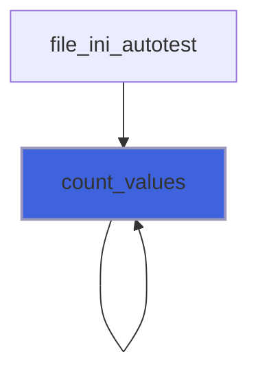

### has_options

Inquire is section has options (at least one).

**Attributes**: elemental

**Returns**: `logical`

```fortran
function has_options(self)
```

**Arguments**

| Name | Type | Intent | Attributes | Description |
|------|------|--------|------------|-------------|
| `self` | class([section](/api/src/lib/finer_section_t#section)) | in |  | Section data. |

**Call graph**

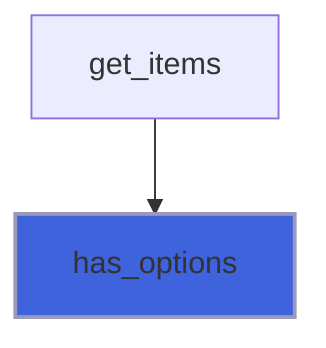

### index_option

Return the index of the option matching the name passed.

 @note The matching index returned is the first found if *back* is not passed or if *back=.false.*. On the contrary the last
 found is returned if *back=.true.*.

**Attributes**: elemental

**Returns**: `integer(kind=I4P)`

```fortran
function index_option(self, option_name, back) result(ind)
```

**Arguments**

| Name | Type | Intent | Attributes | Description |
|------|------|--------|------------|-------------|
| `self` | class([section](/api/src/lib/finer_section_t#section)) | in |  | Section data. |
| `option_name` | character(len=*) | in |  | Option name. |
| `back` | logical | in | optional | If back appears with the value true, the last matching index is returned. |

### loop

Loop returning option name/value defined into section.

**Returns**: `logical`

```fortran
function loop(self, option_pairs) result(again)
```

**Arguments**

| Name | Type | Intent | Attributes | Description |
|------|------|--------|------------|-------------|
| `self` | class([section](/api/src/lib/finer_section_t#section)) | in |  | Section data. |
| `option_pairs` | character(len=:) | out | allocatable | Couples option name/value [1:2]. |

**Call graph**

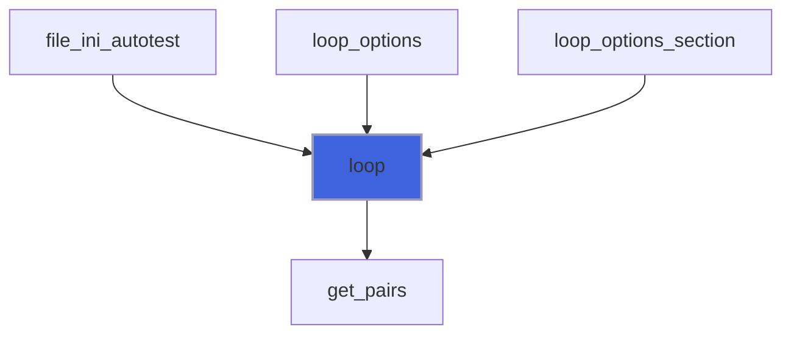

### max_chars_len

Return the maximum number of characters between option-name/option-values on all options.

**Attributes**: elemental

**Returns**: `integer(kind=I4P)`

```fortran
function max_chars_len(self)
```

**Arguments**

| Name | Type | Intent | Attributes | Description |
|------|------|--------|------------|-------------|
| `self` | class([section](/api/src/lib/finer_section_t#section)) | in |  | Section data. |

**Call graph**

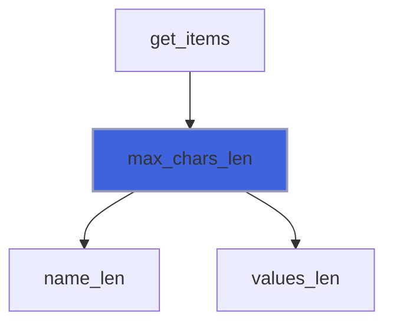

### name

Return section name.

**Attributes**: pure

**Returns**: `character(len=len)`

```fortran
function name(self)
```

**Arguments**

| Name | Type | Intent | Attributes | Description |
|------|------|--------|------------|-------------|
| `self` | class([section](/api/src/lib/finer_section_t#section)) | in |  | Section data. |

**Call graph**

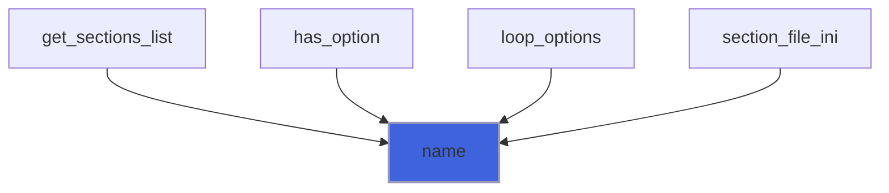

### options_number

Return the options number.

**Attributes**: elemental

**Returns**: `integer(kind=I4P)`

```fortran
function options_number(self)
```

**Arguments**

| Name | Type | Intent | Attributes | Description |
|------|------|--------|------------|-------------|
| `self` | class([section](/api/src/lib/finer_section_t#section)) | in |  | Section data. |

**Call graph**

```mermaid
flowchart TD
  get_items["get_items"] --> options_number["options_number"]
  style options_number fill:#3e63dd,stroke:#99b,stroke-width:2px
```

### section_eq_string

Equal to string logical operator.

**Attributes**: elemental

**Returns**: `logical`

```fortran
function section_eq_string(lhs, rhs) result(is_it)
```

**Arguments**

| Name | Type | Intent | Attributes | Description |
|------|------|--------|------------|-------------|
| `lhs` | class([section](/api/src/lib/finer_section_t#section)) | in |  | Left hand side. |
| `rhs` | type(string) | in |  | Right hand side. |

### section_eq_character

Equal to character logical operator.

**Attributes**: elemental

**Returns**: `logical`

```fortran
function section_eq_character(lhs, rhs) result(is_it)
```

**Arguments**

| Name | Type | Intent | Attributes | Description |
|------|------|--------|------------|-------------|
| `lhs` | class([section](/api/src/lib/finer_section_t#section)) | in |  | Left hand side. |
| `rhs` | character(kind=CK, len=*) | in |  | Right hand side. |

### new_section

Return a new (initiliazed) section instance.

**Attributes**: elemental

**Returns**: type([section](/api/src/lib/finer_section_t#section))

```fortran
function new_section(section_name)
```

**Arguments**

| Name | Type | Intent | Attributes | Description |
|------|------|--------|------------|-------------|
| `section_name` | character(len=*) | in | optional | Option name. |
