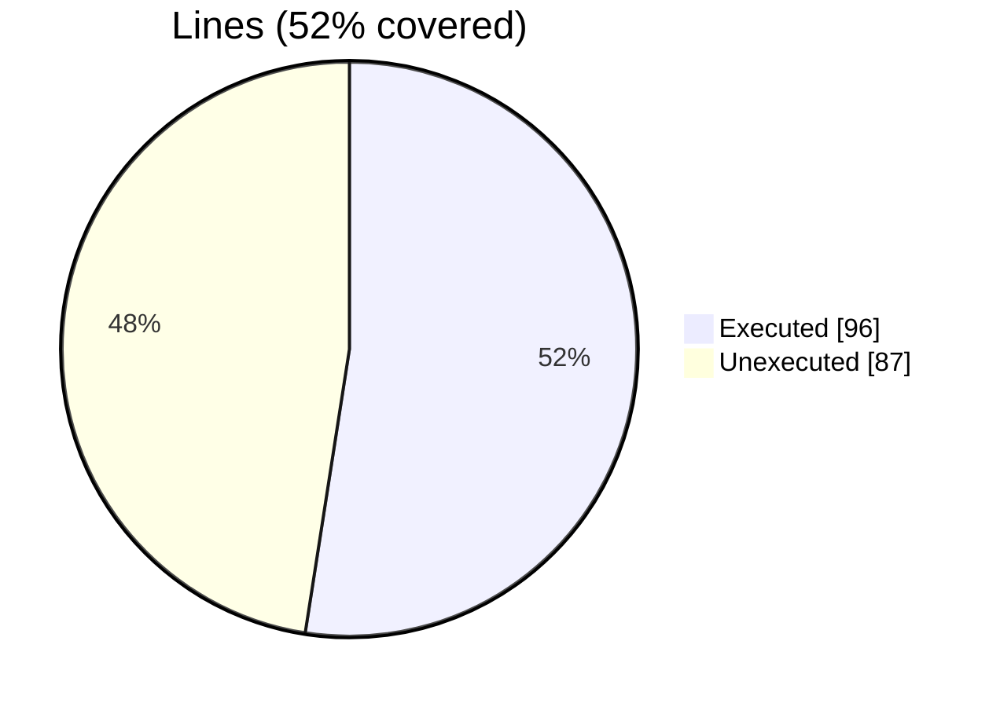
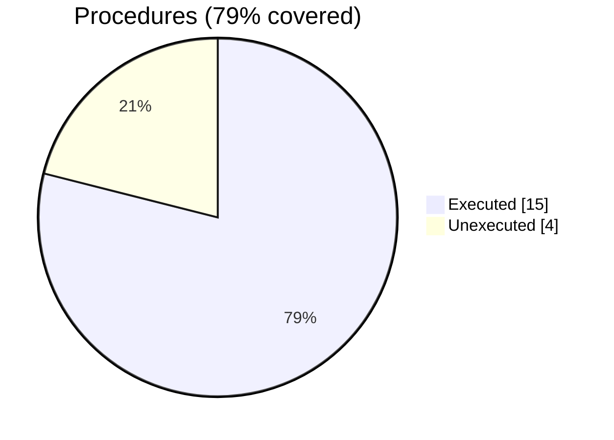
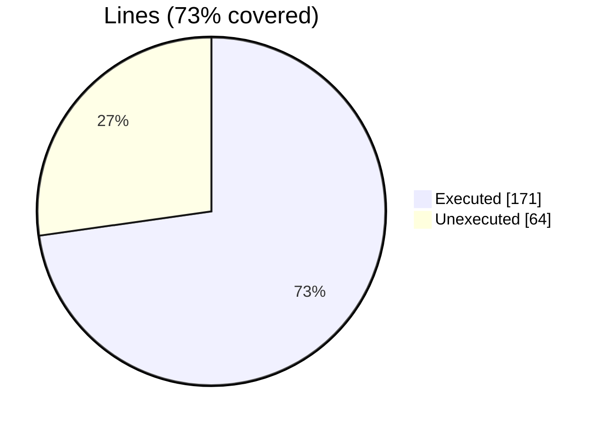
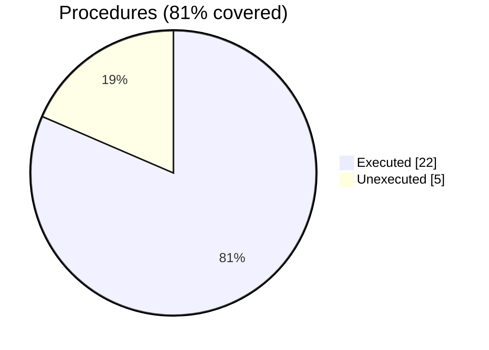
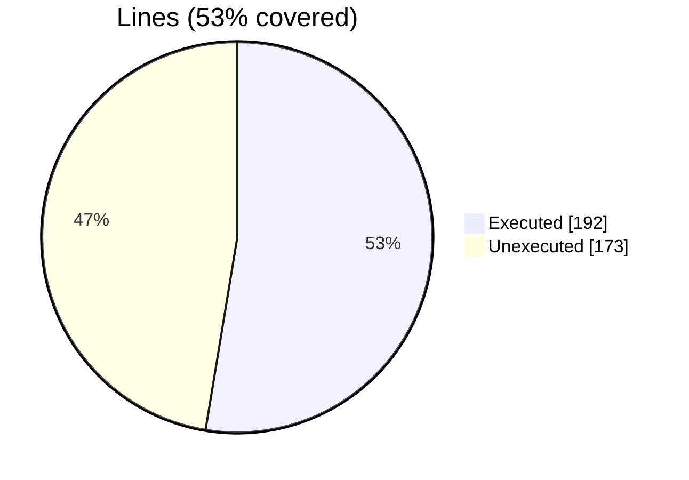
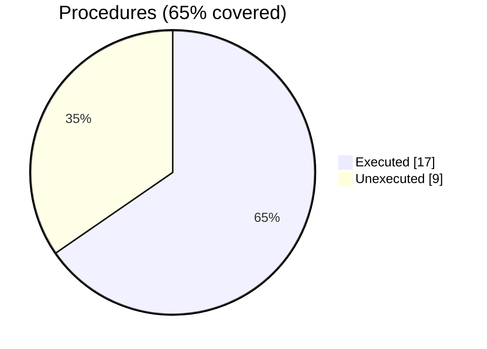

### coverage-analysis

#### [[finer_option_t.F90.gcov]]

|Lines| | |
| --- | --- | --- |
|Executable lines            |183| |
|Executed lines              |96|52%|
|Unexecuted lines            |87|48%|
|Average hits / executed     |12| |

|Procedures| | |
| --- | --- | --- |
|Total procedures            |19| |
|Executed procedures         |15|79%|
|Unexecuted procedures       |4|21%|
|Average hits / executed     |13| |

#### [[finer_section_t.f90.gcov]]

|Lines| | |
| --- | --- | --- |
|Executable lines            |235| |
|Executed lines              |171|73%|
|Unexecuted lines            |64|27%|
|Average hits / executed     |10| |

|Procedures| | |
| --- | --- | --- |
|Total procedures            |27| |
|Executed procedures         |22|81%|
|Unexecuted procedures       |5|19%|
|Average hits / executed     |9| |

#### [[finer_file_ini_t.F90.gcov]]

|Lines| | |
| --- | --- | --- |
|Executable lines            |365| |
|Executed lines              |192|53%|
|Unexecuted lines            |173|47%|
|Average hits / executed     |8| |

|Procedures| | |
| --- | --- | --- |
|Total procedures            |26| |
|Executed procedures         |17|65%|
|Unexecuted procedures       |9|35%|
|Average hits / executed     |4| |

