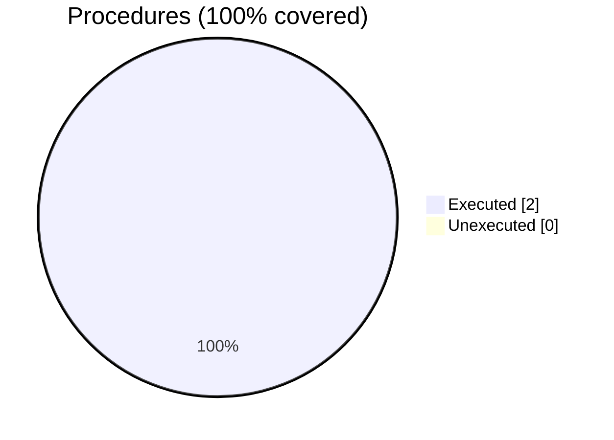
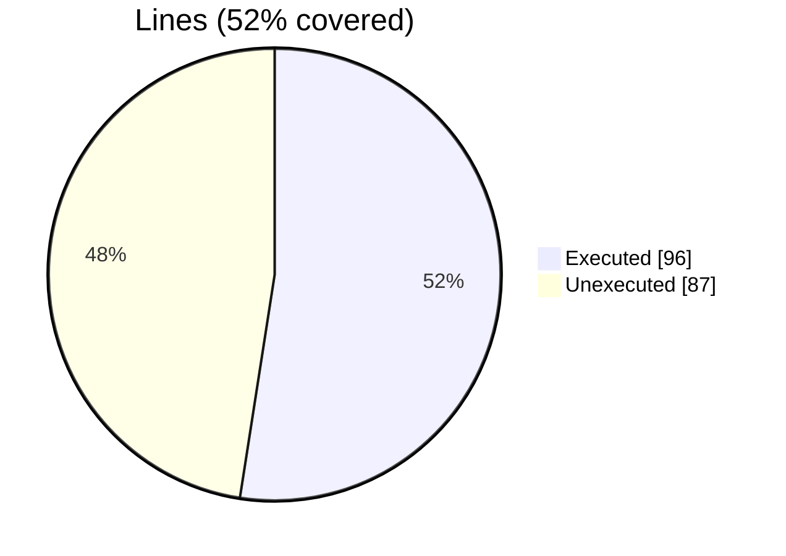
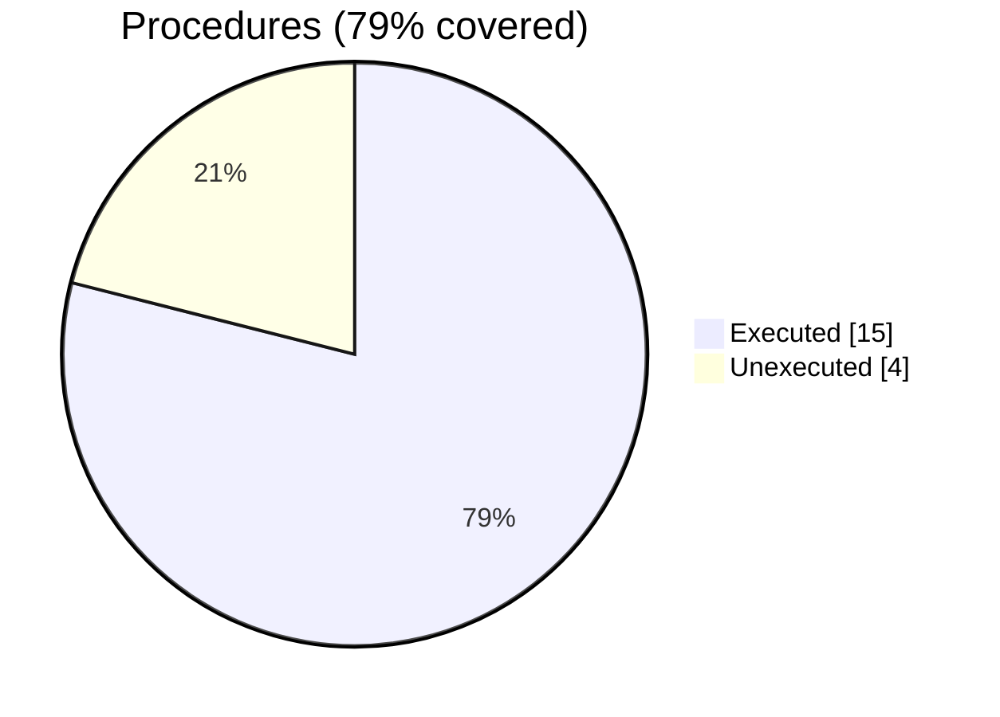
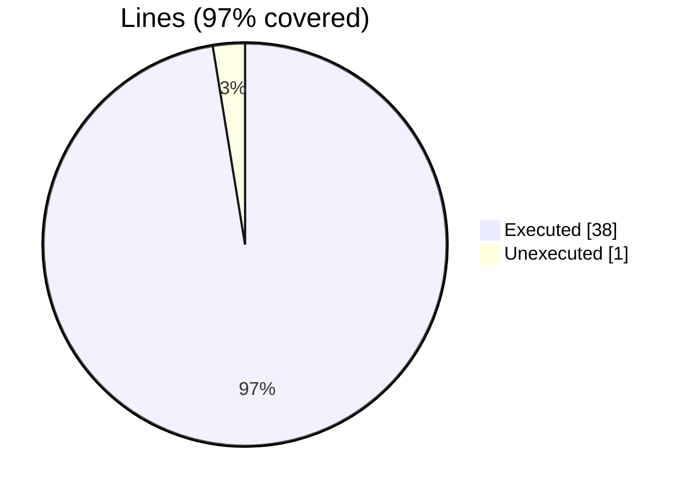
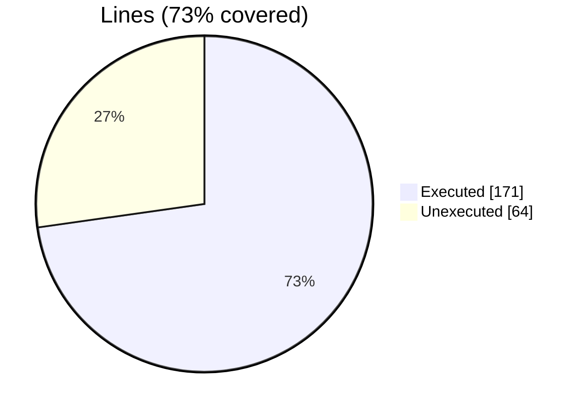
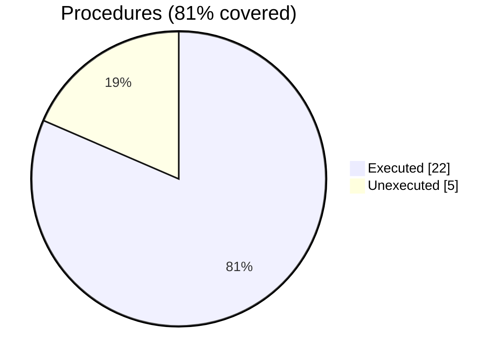
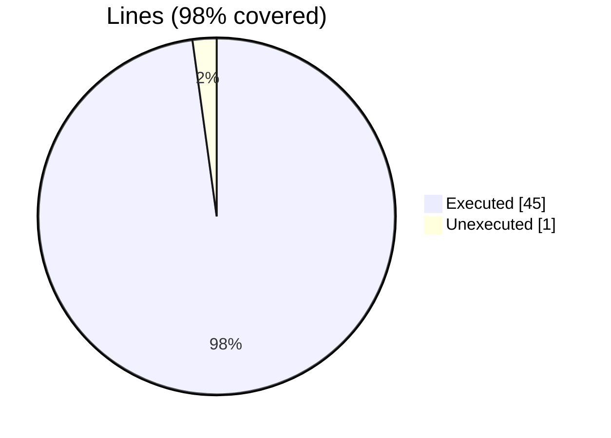
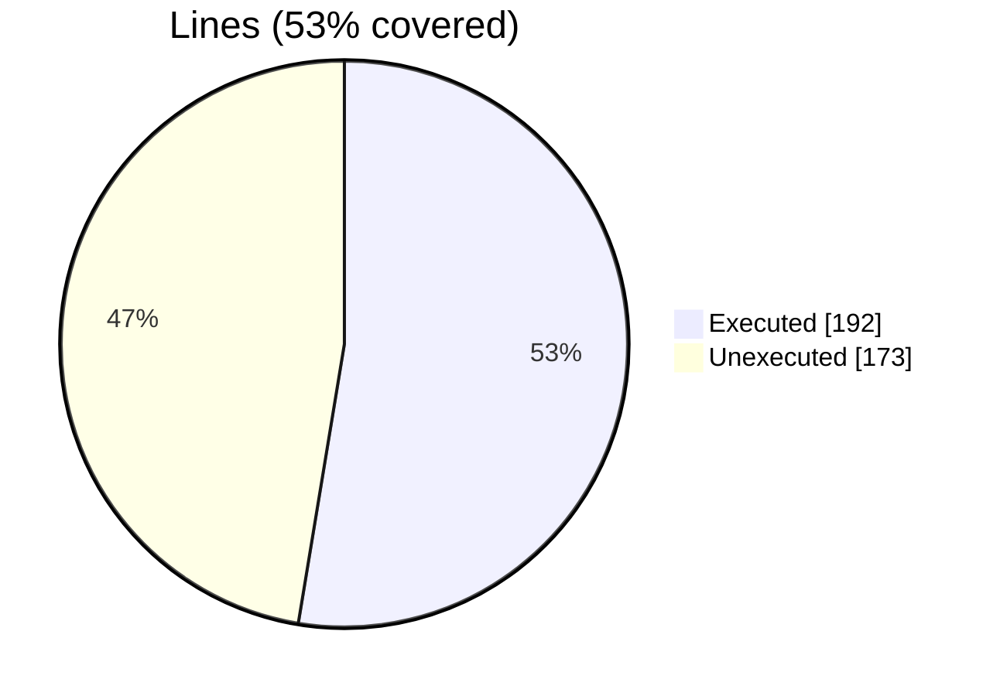
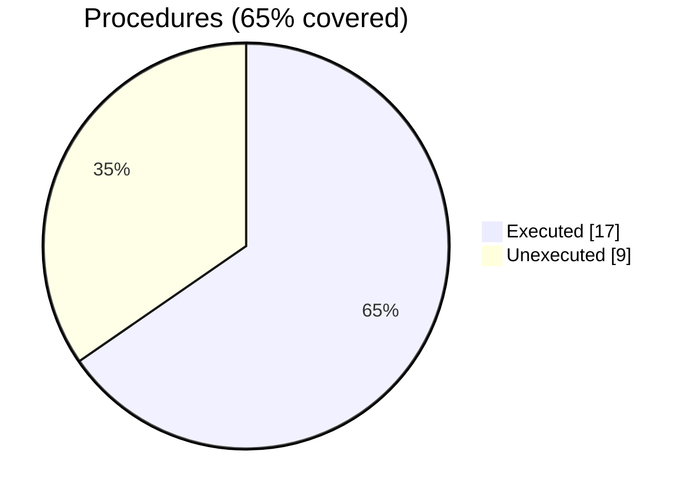

### coverage-analysis

#### [[finer_test_load.f90.gcov]]

|Lines| | |
| --- | --- | --- |
|Executable lines            |34| |
|Executed lines              |33|97%|
|Unexecuted lines            |1|3%|
|Average hits / executed     |2.1515151515151514| |

```mermaid
pie showData
    title Lines (97% covered)
    "Executed" : 33
    "Unexecuted" : 1
```

|Procedures| | |
| --- | --- | --- |
|Total procedures            |2| |
|Executed procedures         |2|100%|
|Unexecuted procedures       |0|0%|
|Average hits / executed     |4.0| |

```mermaid
pie showData
    title Procedures (100% covered)
    "Executed" : 2
    "Unexecuted" : 0
```

#### [[finer_option_t.F90.gcov]]

|Lines| | |
| --- | --- | --- |
|Executable lines            |183| |
|Executed lines              |96|52%|
|Unexecuted lines            |87|48%|
|Average hits / executed     |12.96875| |

```mermaid
pie showData
    title Lines (52% covered)
    "Executed" : 96
    "Unexecuted" : 87
```

|Procedures| | |
| --- | --- | --- |
|Total procedures            |19| |
|Executed procedures         |15|79%|
|Unexecuted procedures       |4|21%|
|Average hits / executed     |13.4| |

```mermaid
pie showData
    title Procedures (79% covered)
    "Executed" : 15
    "Unexecuted" : 4
```

#### [[finer_test_update_option.f90.gcov]]

|Lines| | |
| --- | --- | --- |
|Executable lines            |39| |
|Executed lines              |38|97%|
|Unexecuted lines            |1|3%|
|Average hits / executed     |1.9473684210526316| |

```mermaid
pie showData
    title Lines (97% covered)
    "Executed" : 38
    "Unexecuted" : 1
```

|Procedures| | |
| --- | --- | --- |
|Total procedures            |2| |
|Executed procedures         |2|100%|
|Unexecuted procedures       |0|0%|
|Average hits / executed     |4.0| |

```mermaid
pie showData
    title Procedures (100% covered)
    "Executed" : 2
    "Unexecuted" : 0
```

#### [[finer_section_t.f90.gcov]]

|Lines| | |
| --- | --- | --- |
|Executable lines            |235| |
|Executed lines              |171|73%|
|Unexecuted lines            |64|27%|
|Average hits / executed     |10.502923976608187| |

```mermaid
pie showData
    title Lines (73% covered)
    "Executed" : 171
    "Unexecuted" : 64
```

|Procedures| | |
| --- | --- | --- |
|Total procedures            |27| |
|Executed procedures         |22|81%|
|Unexecuted procedures       |5|19%|
|Average hits / executed     |9.636363636363637| |

```mermaid
pie showData
    title Procedures (81% covered)
    "Executed" : 22
    "Unexecuted" : 5
```

#### [[finer_test_get.f90.gcov]]

|Lines| | |
| --- | --- | --- |
|Executable lines            |46| |
|Executed lines              |45|98%|
|Unexecuted lines            |1|2%|
|Average hits / executed     |2.7777777777777777| |

```mermaid
pie showData
    title Lines (98% covered)
    "Executed" : 45
    "Unexecuted" : 1
```

|Procedures| | |
| --- | --- | --- |
|Total procedures            |2| |
|Executed procedures         |2|100%|
|Unexecuted procedures       |0|0%|
|Average hits / executed     |7.5| |

```mermaid
pie showData
    title Procedures (100% covered)
    "Executed" : 2
    "Unexecuted" : 0
```

#### [[finer_file_ini_t.F90.gcov]]

|Lines| | |
| --- | --- | --- |
|Executable lines            |365| |
|Executed lines              |192|53%|
|Unexecuted lines            |173|47%|
|Average hits / executed     |8.5625| |

```mermaid
pie showData
    title Lines (53% covered)
    "Executed" : 192
    "Unexecuted" : 173
```

|Procedures| | |
| --- | --- | --- |
|Total procedures            |26| |
|Executed procedures         |17|65%|
|Unexecuted procedures       |9|35%|
|Average hits / executed     |4.352941176470588| |

```mermaid
pie showData
    title Procedures (65% covered)
    "Executed" : 17
    "Unexecuted" : 9
```

#### [[finer_test_parse.f90.gcov]]

|Lines| | |
| --- | --- | --- |
|Executable lines            |42| |
|Executed lines              |41|98%|
|Unexecuted lines            |1|2%|
|Average hits / executed     |2.073170731707317| |

```mermaid
pie showData
    title Lines (98% covered)
    "Executed" : 41
    "Unexecuted" : 1
```

|Procedures| | |
| --- | --- | --- |
|Total procedures            |2| |
|Executed procedures         |2|100%|
|Unexecuted procedures       |0|0%|
|Average hits / executed     |4.5| |

```mermaid
pie showData
    title Procedures (100% covered)
    "Executed" : 2
    "Unexecuted" : 0
```

#### [[finer_test_autotest.f90.gcov]]

|Lines| | |
| --- | --- | --- |
|Executable lines            |42| |
|Executed lines              |41|98%|
|Unexecuted lines            |1|2%|
|Average hits / executed     |2.975609756097561| |

```mermaid
pie showData
    title Lines (98% covered)
    "Executed" : 41
    "Unexecuted" : 1
```

|Procedures| | |
| --- | --- | --- |
|Total procedures            |2| |
|Executed procedures         |2|100%|
|Unexecuted procedures       |0|0%|
|Average hits / executed     |7.5| |

```mermaid
pie showData
    title Procedures (100% covered)
    "Executed" : 2
    "Unexecuted" : 0
```

