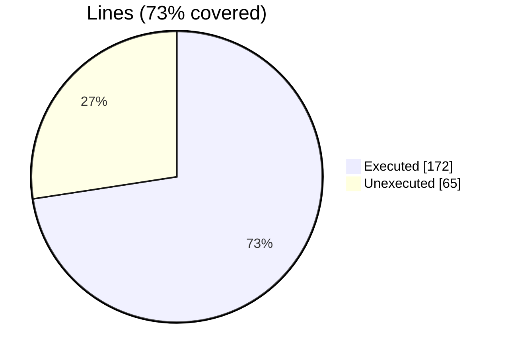
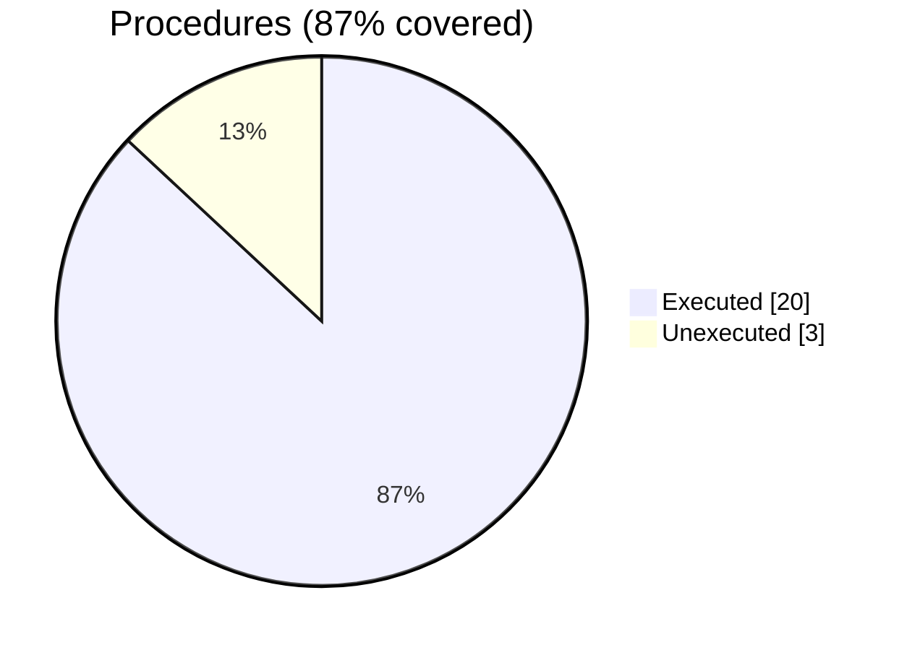
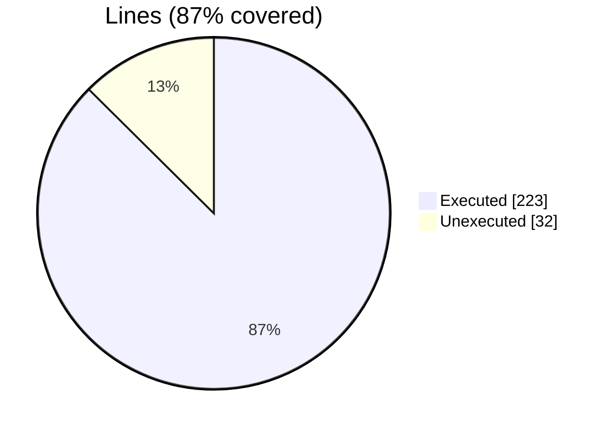
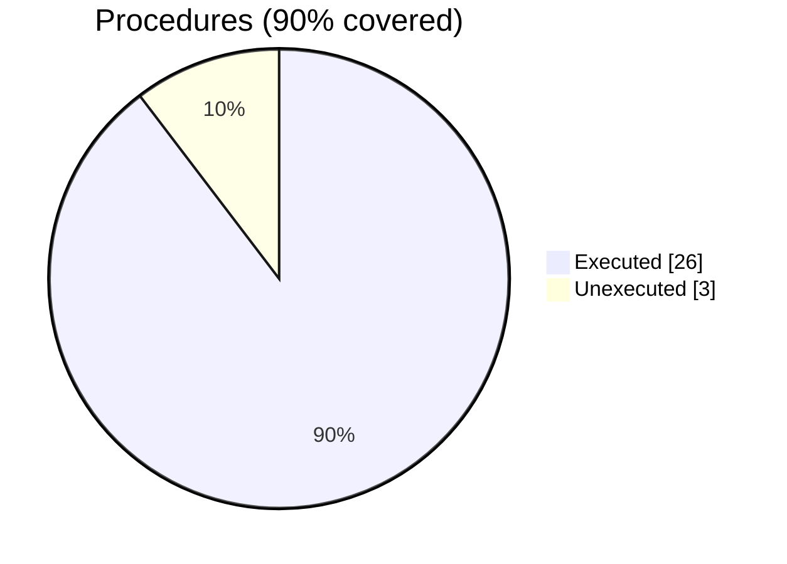
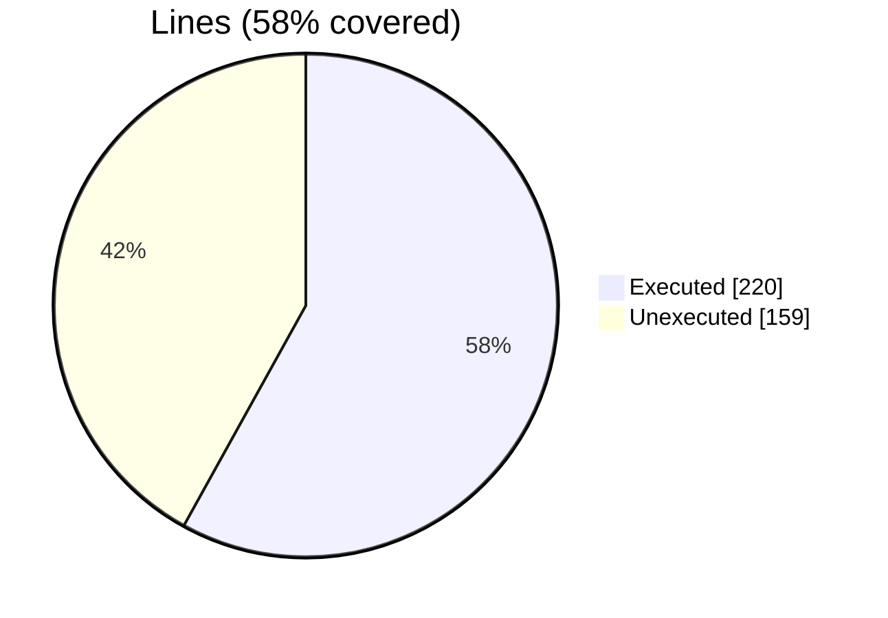
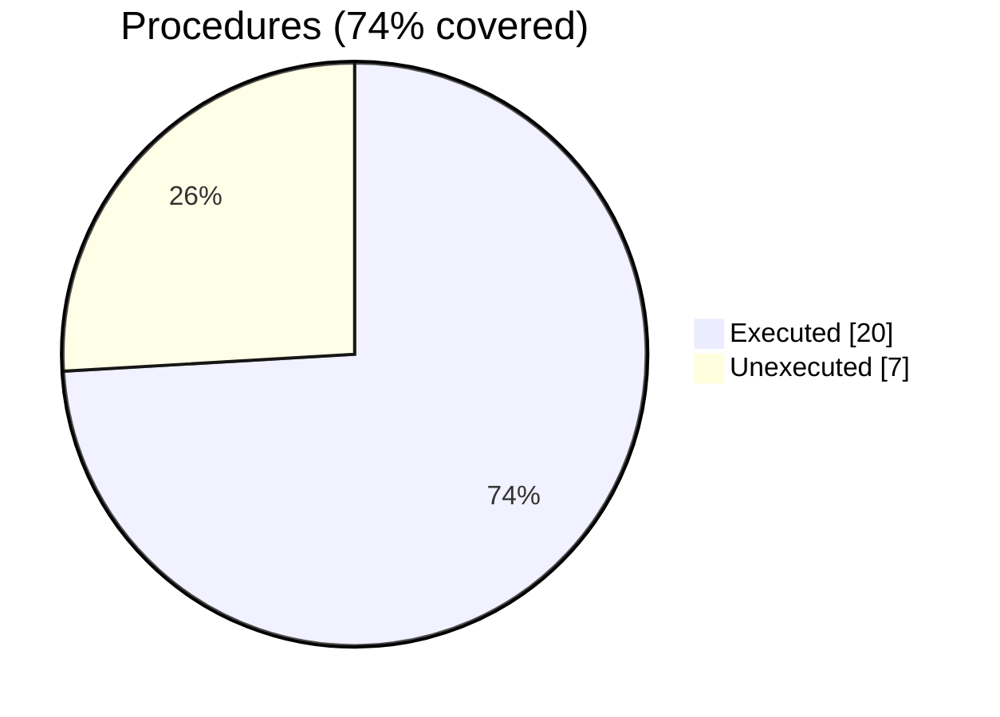

### coverage-analysis

#### [[finer_option_t.F90.gcov]]

|Lines| | |
| --- | --- | --- |
|Executable lines            |237| |
|Executed lines              |172|73%|
|Unexecuted lines            |65|27%|
|Average hits / executed     |32.83139534883721| |

```mermaid
pie showData
    title Lines (73% covered)
    "Executed" : 172
    "Unexecuted" : 65
```

|Procedures| | |
| --- | --- | --- |
|Total procedures            |23| |
|Executed procedures         |20|87%|
|Unexecuted procedures       |3|13%|
|Average hits / executed     |47.85| |

```mermaid
pie showData
    title Procedures (87% covered)
    "Executed" : 20
    "Unexecuted" : 3
```

#### [[finer_section_t.f90.gcov]]

|Lines| | |
| --- | --- | --- |
|Executable lines            |255| |
|Executed lines              |223|87%|
|Unexecuted lines            |32|13%|
|Average hits / executed     |28.19730941704036| |

```mermaid
pie showData
    title Lines (87% covered)
    "Executed" : 223
    "Unexecuted" : 32
```

|Procedures| | |
| --- | --- | --- |
|Total procedures            |29| |
|Executed procedures         |26|90%|
|Unexecuted procedures       |3|10%|
|Average hits / executed     |27.923076923076923| |

```mermaid
pie showData
    title Procedures (90% covered)
    "Executed" : 26
    "Unexecuted" : 3
```

#### [[finer_file_ini_t.F90.gcov]]

|Lines| | |
| --- | --- | --- |
|Executable lines            |379| |
|Executed lines              |220|58%|
|Unexecuted lines            |159|42%|
|Average hits / executed     |17.913636363636364| |

```mermaid
pie showData
    title Lines (58% covered)
    "Executed" : 220
    "Unexecuted" : 159
```

|Procedures| | |
| --- | --- | --- |
|Total procedures            |27| |
|Executed procedures         |20|74%|
|Unexecuted procedures       |7|26%|
|Average hits / executed     |11.65| |

```mermaid
pie showData
    title Procedures (74% covered)
    "Executed" : 20
    "Unexecuted" : 7
```

