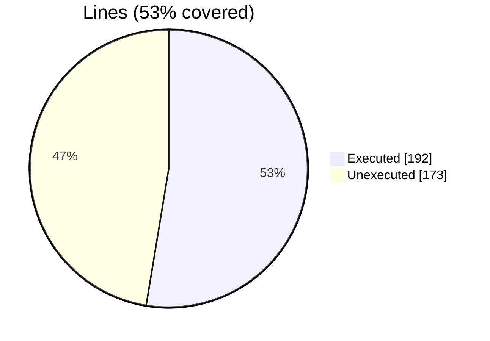
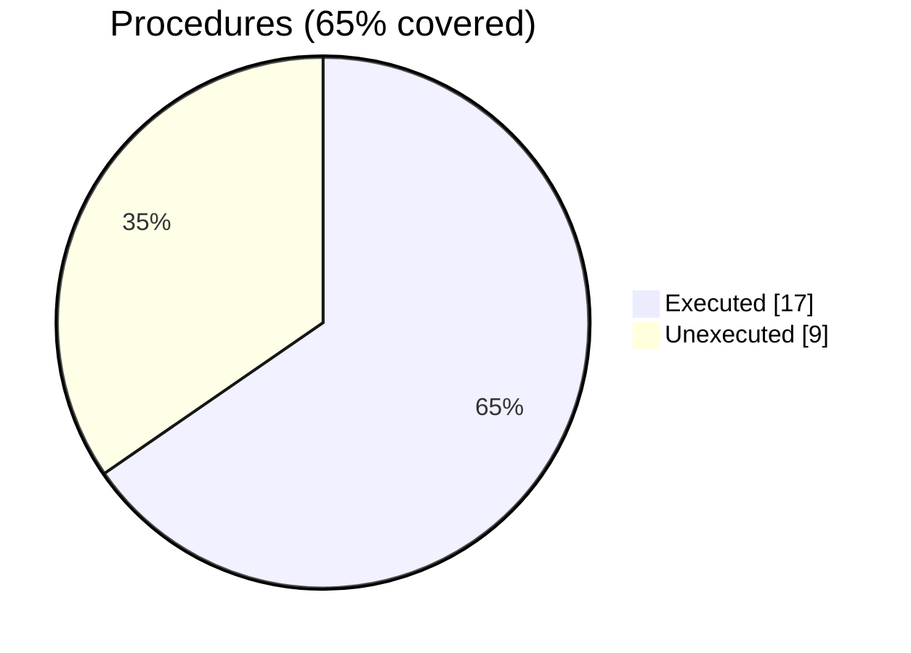

### Coverage analysis of *finer_file_ini_t.F90*

|Lines| | |
| --- | --- | --- |
|Executable lines            |365| |
|Executed lines              |192|53%|
|Unexecuted lines            |173|47%|
|Average hits / executed     |8| |

|Procedures| | |
| --- | --- | --- |
|Total procedures            |26| |
|Executed procedures         |17|65%|
|Unexecuted procedures       |9|35%|
|Average hits / executed     |4| |

#### Unexecuted procedures

 + *function* **section_file_ini**, line 301
 + *subroutine* **add_a_option**, line 315
 + *subroutine* **assign_file_ini**, line 661
 + *subroutine* **file_ini_autotest**, line 675
 + *subroutine* **free_options_all**, line 394
 + *subroutine* **free_options_of_section**, line 412
 + *subroutine* **initialize**, line 202
 + *subroutine* **print_file_ini**, line 250
 + *subroutine* **save_file_ini**, line 275

#### Executed procedures

 + *function* **index_section**: tested **18** times
 + *subroutine* **get_option**: tested **11** times
 + *subroutine* **load**: tested **6** times
 + *subroutine* **parse**: tested **6** times
 + *subroutine* **get_sections_list**: tested **5** times
 + *function* **has_option**: tested **5** times
 + *function* **count_values**: tested **3** times
 + *function* **has_section**: tested **3** times
 + *subroutine* **add_section**: tested **3** times
 + *subroutine* **get_a_option**: tested **3** times
 + *function* **loop_options_section**: tested **3** times
 + *subroutine* **add_option**: tested **2** times
 + *function* **index_option**: tested **2** times
 + *subroutine* **free**: tested **1** times
 + *subroutine* **get_items**: tested **1** times
 + *subroutine* **free_option_of_section**: tested **1** times
 + *subroutine* **free_section**: tested **1** times

 --- 
 Report generated by [FoBiS.py](https://github.com/szaghi/FoBiS)