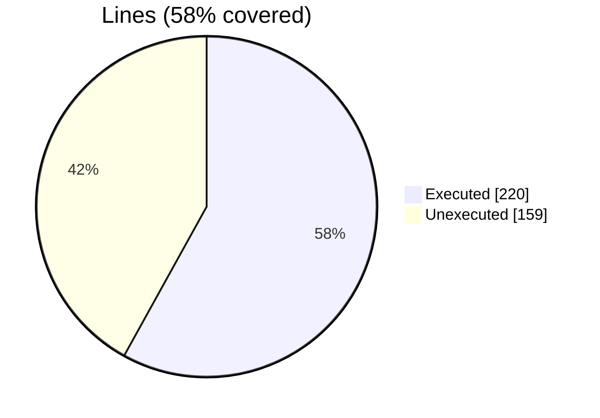
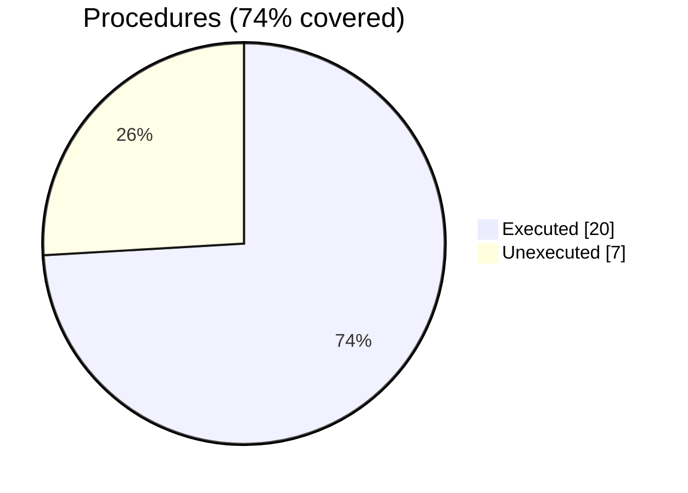

### Coverage analysis of *finer_file_ini_t.F90*

|Lines| | |
| --- | --- | --- |
|Executable lines            |379| |
|Executed lines              |220|58%|
|Unexecuted lines            |159|42%|
|Average hits / executed     |17.913636363636364| |

```mermaid
pie showData
    title Lines (58% covered)
    "Executed" : 220
    "Unexecuted" : 159
```

|Procedures| | |
| --- | --- | --- |
|Total procedures            |27| |
|Executed procedures         |20|74%|
|Unexecuted procedures       |7|26%|
|Average hits / executed     |11.65| |

```mermaid
pie showData
    title Procedures (74% covered)
    "Executed" : 20
    "Unexecuted" : 7
```

#### Unexecuted procedures

 + *function* **section_file_ini**, line 327
 + *subroutine* **assign_file_ini**, line 709
 + *subroutine* **free_options_all**, line 420
 + *subroutine* **free_options_of_section**, line 438
 + *subroutine* **initialize**, line 228
 + *subroutine* **print_file_ini**, line 276
 + *subroutine* **save_file_ini**, line 301

#### Executed procedures

 + *subroutine* **get_option**: tested **54** times
 + *function* **index_section**: tested **49** times
 + *subroutine* **get_a_option**: tested **30** times
 + *subroutine* **add_section**: tested **15** times
 + *subroutine* **load**: tested **12** times
 + *subroutine* **parse**: tested **12** times
 + *subroutine* **add_option**: tested **9** times
 + *function* **count_values**: tested **8** times
 + *subroutine* **get_string**: tested **8** times
 + *subroutine* **free**: tested **7** times
 + *function* **has_option**: tested **7** times
 + *subroutine* **get_sections_list**: tested **5** times
 + *subroutine* **add_a_option**: tested **5** times
 + *function* **has_section**: tested **3** times
 + *function* **loop_options_section**: tested **3** times
 + *function* **index_option**: tested **2** times
 + *subroutine* **get_items**: tested **1** times
 + *subroutine* **free_option_of_section**: tested **1** times
 + *subroutine* **free_section**: tested **1** times
 + *subroutine* **file_ini_autotest**: tested **1** times

 --- 
 Report generated by [FoBiS.py](https://github.com/szaghi/FoBiS)