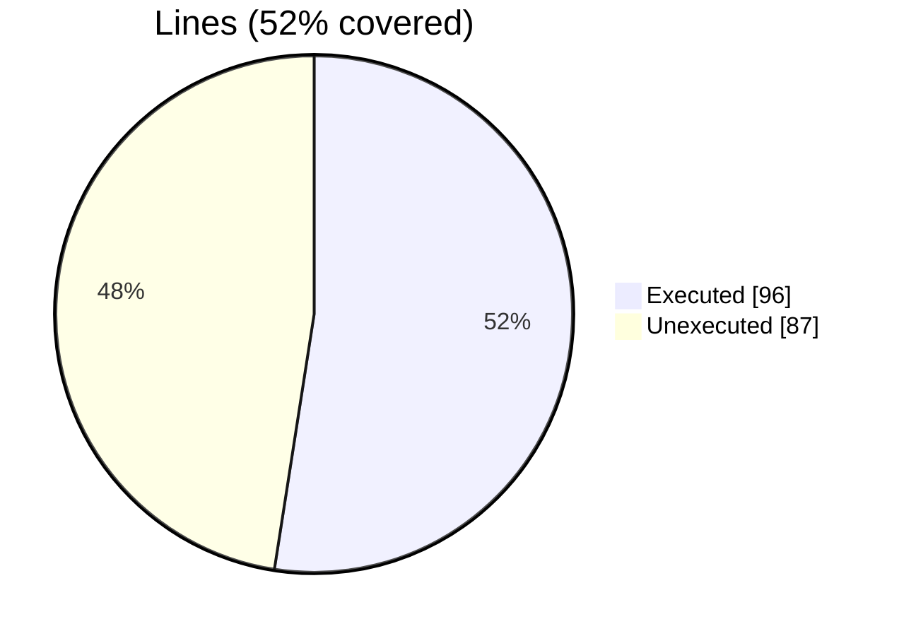
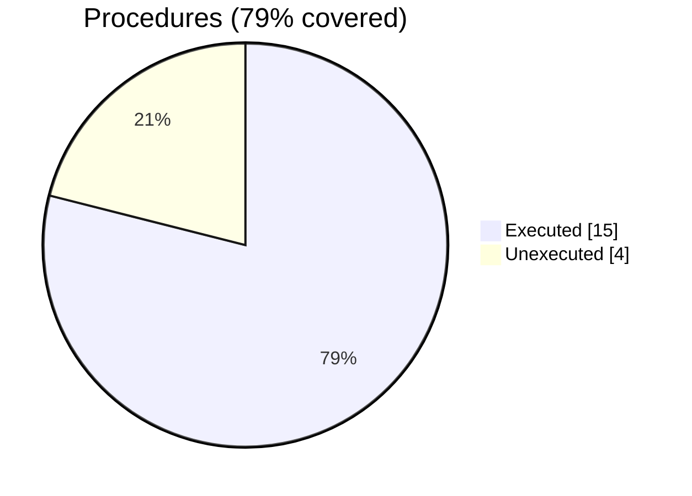

### Coverage analysis of *finer_option_t.F90*

|Lines| | |
| --- | --- | --- |
|Executable lines            |183| |
|Executed lines              |96|52%|
|Unexecuted lines            |87|48%|
|Average hits / executed     |12| |

|Procedures| | |
| --- | --- | --- |
|Total procedures            |19| |
|Executed procedures         |15|79%|
|Unexecuted procedures       |4|21%|
|Average hits / executed     |13| |

#### Unexecuted procedures

 + *function* **option_eq_string**, line 436
 + *subroutine* **print_option**, line 285
 + *subroutine* **save_option**, line 401
 + *subroutine* **set_a_option**, line 340

#### Executed procedures

 + *function* **option_eq_character**: tested **56** times
 + *subroutine* **parse**: tested **26** times
 + *subroutine* **parse_comment**: tested **26** times
 + *subroutine* **parse_name**: tested **26** times
 + *subroutine* **parse_value**: tested **26** times
 + *subroutine* **get_option**: tested **10** times
 + *subroutine* **assign_option**: tested **7** times
 + *subroutine* **get_pairs**: tested **5** times
 + *subroutine* **free**: tested **4** times
 + *function* **count_values**: tested **3** times
 + *function* **name_len**: tested **3** times
 + *function* **values_len**: tested **3** times
 + *subroutine* **get_a_option**: tested **3** times
 + *subroutine* **set_option**: tested **2** times
 + *function* **new_option**: tested **1** times

 --- 
 Report generated by [FoBiS.py](https://github.com/szaghi/FoBiS)