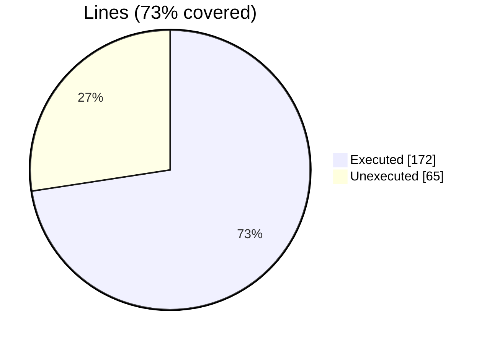
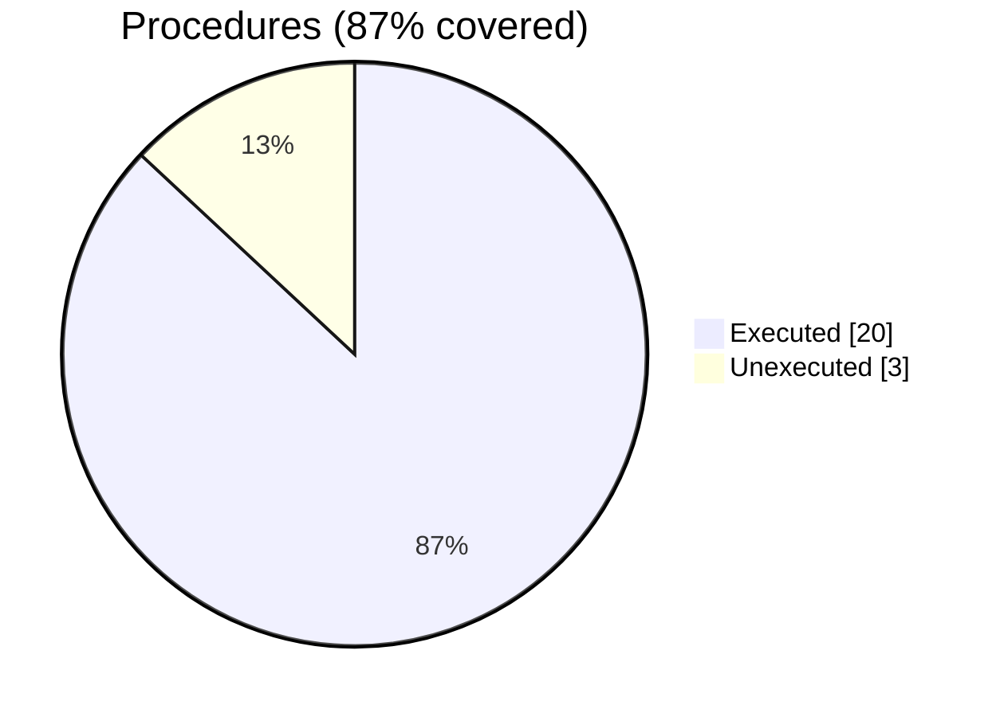

### Coverage analysis of *finer_option_t.F90*

|Lines| | |
| --- | --- | --- |
|Executable lines            |237| |
|Executed lines              |172|73%|
|Unexecuted lines            |65|27%|
|Average hits / executed     |32.83139534883721| |

```mermaid
pie showData
    title Lines (73% covered)
    "Executed" : 172
    "Unexecuted" : 65
```

|Procedures| | |
| --- | --- | --- |
|Total procedures            |23| |
|Executed procedures         |20|87%|
|Unexecuted procedures       |3|13%|
|Average hits / executed     |47.85| |

```mermaid
pie showData
    title Procedures (87% covered)
    "Executed" : 20
    "Unexecuted" : 3
```

#### Unexecuted procedures

 + *function* **option_eq_string**, line 416
 + *subroutine* **print_option**, line 247
 + *subroutine* **save_option**, line 381

#### Executed procedures

 + *function* **option_eq_character**: tested **387** times
 + *subroutine* **convert**: tested **89** times
 + *function* **is_numeric**: tested **59** times
 + *subroutine* **parse**: tested **57** times
 + *subroutine* **parse_comment**: tested **57** times
 + *subroutine* **parse_name**: tested **57** times
 + *subroutine* **parse_value**: tested **57** times
 + *subroutine* **get_option**: tested **41** times
 + *subroutine* **assign_option**: tested **41** times
 + *subroutine* **free**: tested **29** times
 + *subroutine* **assign_default**: tested **24** times
 + *subroutine* **get_a_option**: tested **13** times
 + *function* **new_option**: tested **10** times
 + *subroutine* **set_option**: tested **9** times
 + *function* **count_values**: tested **6** times
 + *subroutine* **get_pairs**: tested **5** times
 + *subroutine* **get_string**: tested **5** times
 + *subroutine* **set_a_option**: tested **5** times
 + *function* **name_len**: tested **3** times
 + *function* **values_len**: tested **3** times

 --- 
 Report generated by [FoBiS.py](https://github.com/szaghi/FoBiS)