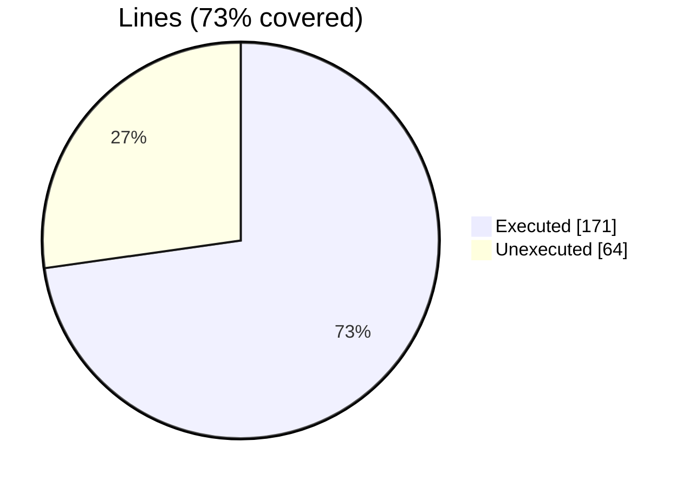
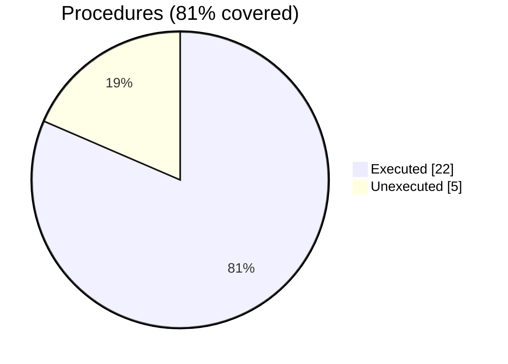

### Coverage analysis of *finer_section_t.f90*

|Lines| | |
| --- | --- | --- |
|Executable lines            |235| |
|Executed lines              |171|73%|
|Unexecuted lines            |64|27%|
|Average hits / executed     |10| |

|Procedures| | |
| --- | --- | --- |
|Total procedures            |27| |
|Executed procedures         |22|81%|
|Unexecuted procedures       |5|19%|
|Average hits / executed     |9| |

#### Unexecuted procedures

 + *function* **section_eq_string**, line 538
 + *subroutine* **add_a_option**, line 323
 + *subroutine* **print_section**, line 248
 + *subroutine* **save_section**, line 272
 + *subroutine* **set_a_option**, line 499

#### Executed procedures

 + *function* **section_eq_character**: tested **52** times
 + *function* **name**: tested **27** times
 + *subroutine* **parse**: tested **24** times
 + *subroutine* **parse_options**: tested **24** times
 + *function* **index_option**: tested **12** times
 + *subroutine* **parse_name**: tested **12** times
 + *subroutine* **sanitize_source**: tested **12** times
 + *subroutine* **get_option**: tested **11** times
 + *subroutine* **assign_section**: tested **5** times
 + *function* **has_options**: tested **4** times
 + *function* **options_number**: tested **4** times
 + *function* **count_values**: tested **3** times
 + *function* **loop**: tested **3** times
 + *subroutine* **option_pairs**: tested **3** times
 + *subroutine* **get_a_option**: tested **3** times
 + *subroutine* **set_option**: tested **3** times
 + *subroutine* **free**: tested **2** times
 + *subroutine* **free_options**: tested **2** times
 + *function* **max_chars_len**: tested **2** times
 + *subroutine* **add_option**: tested **2** times
 + *subroutine* **free_option**: tested **1** times
 + *function* **new_section**: tested **1** times

 --- 
 Report generated by [FoBiS.py](https://github.com/szaghi/FoBiS)