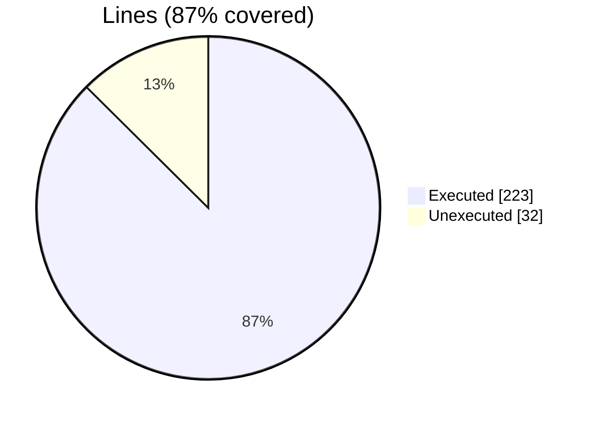
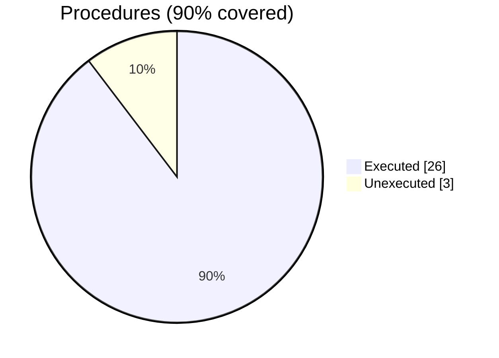

### Coverage analysis of *finer_section_t.f90*

|Lines| | |
| --- | --- | --- |
|Executable lines            |255| |
|Executed lines              |223|87%|
|Unexecuted lines            |32|13%|
|Average hits / executed     |28.19730941704036| |

```mermaid
pie showData
    title Lines (87% covered)
    "Executed" : 223
    "Unexecuted" : 32
```

|Procedures| | |
| --- | --- | --- |
|Total procedures            |29| |
|Executed procedures         |26|90%|
|Unexecuted procedures       |3|10%|
|Average hits / executed     |27.923076923076923| |

```mermaid
pie showData
    title Procedures (90% covered)
    "Executed" : 26
    "Unexecuted" : 3
```

#### Unexecuted procedures

 + *function* **section_eq_string**, line 586
 + *subroutine* **print_section**, line 267
 + *subroutine* **save_section**, line 291

#### Executed procedures

 + *function* **strip_inline_comment**: tested **262** times
 + *function* **section_eq_character**: tested **155** times
 + *subroutine* **get_option**: tested **53** times
 + *subroutine* **parse**: tested **36** times
 + *subroutine* **parse_options**: tested **36** times
 + *function* **index_option**: tested **35** times
 + *function* **name**: tested **27** times
 + *subroutine* **parse_name**: tested **18** times
 + *subroutine* **sanitize_source**: tested **18** times
 + *subroutine* **get_a_option**: tested **15** times
 + *subroutine* **add_option**: tested **9** times
 + *function* **count_values**: tested **7** times
 + *subroutine* **free**: tested **7** times
 + *subroutine* **free_options**: tested **7** times
 + *subroutine* **get_string**: tested **7** times
 + *subroutine* **assign_section**: tested **6** times
 + *subroutine* **add_a_option**: tested **5** times
 + *function* **has_options**: tested **4** times
 + *function* **options_number**: tested **4** times
 + *function* **loop**: tested **3** times
 + *subroutine* **option_pairs**: tested **3** times
 + *subroutine* **set_option**: tested **3** times
 + *function* **max_chars_len**: tested **2** times
 + *function* **new_section**: tested **2** times
 + *subroutine* **free_option**: tested **1** times
 + *subroutine* **set_a_option**: tested **1** times

 --- 
 Report generated by [FoBiS.py](https://github.com/szaghi/FoBiS)