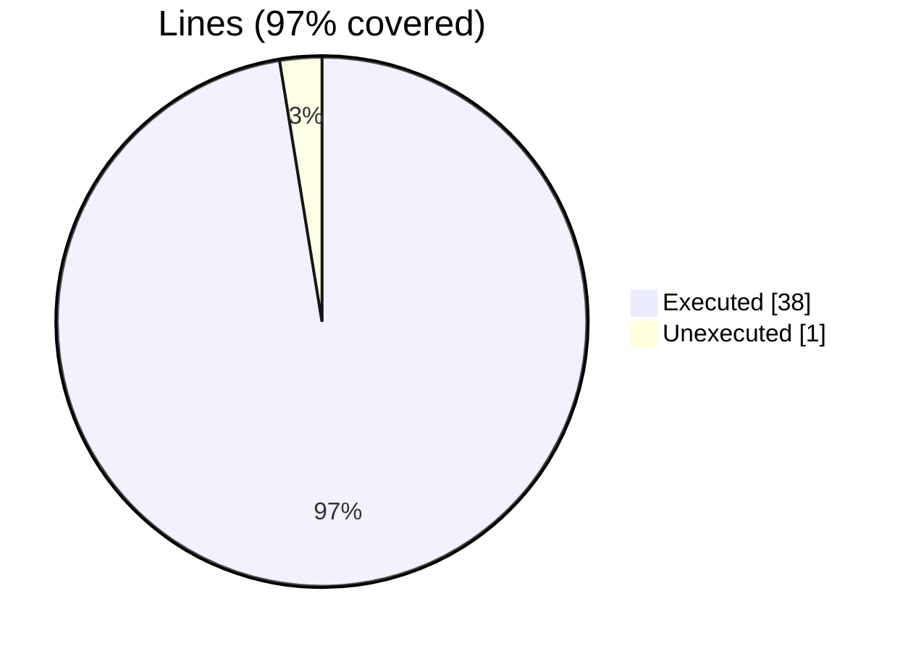
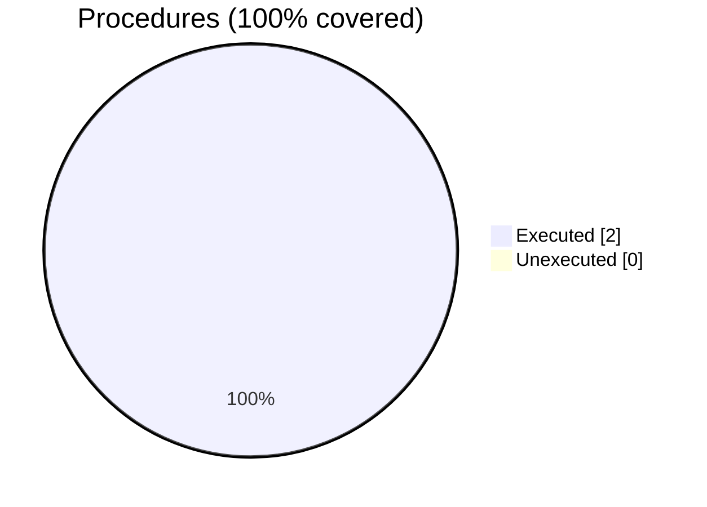

### Coverage analysis of *finer_test_update_option.f90*

|Lines| | |
| --- | --- | --- |
|Executable lines            |39| |
|Executed lines              |38|97%|
|Unexecuted lines            |1|3%|
|Average hits / executed     |1.9473684210526316| |

|Procedures| | |
| --- | --- | --- |
|Total procedures            |2| |
|Executed procedures         |2|100%|
|Unexecuted procedures       |0|0%|
|Average hits / executed     |4.0| |

#### Unexecuted procedures

 + *none*

#### Executed procedures

 + *subroutine* **check**: tested **7** times
 + *subroutine* **summary**: tested **1** times

 --- 
 Report generated by [FoBiS.py](https://github.com/szaghi/FoBiS)